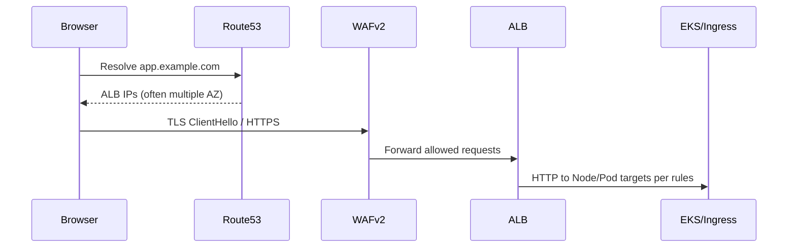

# AWS Production Architecture: Deep Dive Learning Guide

Welcome! If you are new to AWS, Kubernetes, or cloud architecture, this guide is written specifically for you. It breaks down a complex, production-ready web application into four easy-to-understand modules. 

Instead of just listing services, this guide explains *how* they work, *why* we use them, and the mental models you need to understand them.

---

## Module 1: Networking & Edge Layer

If this architecture were a city, this module is the roads, the city walls, and the security checkpoints. It dictates how a user's request travels from their browser, gets secured, and safely arrives at your application's front door.

### 1. The Mental Model: What "The Edge" Actually Is
Users do not "connect to Kubernetes." They open a connection to an IP address. Your edge stack answers three questions in order:
1. **Which IP should the client use?** → DNS (Route 53).
2. **Is this connection allowed and sane?** → TLS + WAF + Security Groups.
3. **Which internal target should handle this HTTP request?** → ALB rules → Kubernetes Pods.

### 2. Amazon VPC (Virtual Private Cloud)
*The Foundation of Cloud Security*

A VPC is your own logically isolated, private section of the AWS cloud. Think of it as a virtual fence around your infrastructure.
*   **CIDR Block & Subnets:** You assign a large pool of IP addresses to your VPC (e.g., `10.0.0.0/16`). You then slice this into smaller chunks called **Subnets**, which live in specific physical data centers (Availability Zones) for redundancy.
*   **Public vs. Private Subnets (The Security Boundary):** 
    *   **Public Subnets** have a direct route to the internet via an **Internet Gateway (IGW)**. Resources here (like Load Balancers) get public IP addresses.
    *   **Private Subnets** have *no* direct inbound route from the internet. This is where your EKS worker nodes and RDS database live. They are completely hidden from the outside world.
*   **NAT Gateway:** If your private servers need to download an update, they can't do it directly. They send the request to a NAT Gateway sitting in the *public* subnet, which fetches the data and hands it back. It allows *outbound* internet access but blocks *inbound* internet access.
*   **Security Groups (SGs) vs. NACLs:**
    *   **Security Groups** are stateful firewalls attached to specific resources. If you allow a request in, the response is automatically allowed out. This is your primary firewall.
    *   **NACLs** are stateless filters applied to entire subnets.
*   **VPC Endpoints (PrivateLink):** Normally, if your private pods want to talk to AWS S3, traffic goes out the NAT Gateway to the public internet and back to AWS. VPC Endpoints create a private tunnel directly to AWS services *within* the AWS network, making it faster, cheaper, and more secure.

### 3. Amazon Route 53
*The Internet's Phonebook*

Computers talk via IP addresses, but humans use names (like `joby.com`). Route 53 bridges this gap.
*   **Hosted Zone:** A container holding all the routing rules (records) for your domain.
*   **ALIAS Record:** An AWS-specific superpower. Load Balancers in AWS change their IP addresses dynamically. An ALIAS record allows Route 53 to map your domain directly to your Load Balancer's underlying AWS resource, automatically keeping track of IP changes.

### 4. AWS Certificate Manager (ACM)
*The Trust Provider*

ACM handles the complexity of creating, storing, and renewing SSL/TLS certificates (the "s" in `https://`).
*   **DNS Validation:** To prove you own a domain, ACM gives you a unique string to put into a Route 53 DNS record. Once ACM sees it, it issues the certificate.
*   **TLS Termination:** In this architecture, the certificate is attached to your Load Balancer. The traffic from the user to the Load Balancer is encrypted. The Load Balancer decrypts it and sends it to your private Kubernetes cluster. This saves your application servers from wasting CPU power on decryption.

### 5. AWS WAF (Web Application Firewall)
*The Bouncer at the Door*

A firewall designed to look at the *contents* of web requests to block malicious activity.
*   **Managed Rule Groups:** AWS security experts maintain lists of known bad IP addresses, bot signatures, and common attack patterns (like SQL Injection). You can just turn these on.
*   **Rate Limiting:** You can tell WAF, "If a single IP makes more than 1,000 requests in 5 minutes, block them." This protects against DDoS attacks and brute-force logins.

### 6. Application Load Balancer (ALB)
*The Traffic Cop*

A Layer 7 load balancer. It understands HTTP/HTTPS traffic, meaning it can look at the URL path and make smart routing decisions.
*   **Listeners & Rules:** You configure rules. For example: *If the URL starts with `/api/*`, send traffic to the Backend. If it's anything else, send it to the Frontend.*
*   **Target Groups & Health Checks:** The ALB constantly pings your Kubernetes pods. If a pod crashes, the ALB stops sending traffic to it until it recovers.

---

## Module 2: Compute & Container Orchestration

This is the engine room. It's where your actual application code runs, consumes CPU and memory, and scales up or down based on demand.

### 1. Amazon ECR (Elastic Container Registry)
*The Secure Vault for Your Application Blueprints*

Before your app can run, it must be packaged into a Docker container image. ECR is AWS's managed service for storing these images.
*   **Immutable Image Tags:** When you push an image, you tag it with a Git commit SHA. "Immutable" means once an image is pushed, it can *never* be overwritten. This guarantees that the exact code you tested in staging is what runs in production.
*   **Vulnerability Scanning:** ECR automatically scans your images for known security vulnerabilities (CVEs) the moment they are pushed.

### 2. Amazon EC2 (Elastic Compute Cloud)
*The Raw Muscle (EKS Worker Nodes)*

EC2 provides the actual virtual machines (VMs) that act as **Worker Nodes** for the EKS cluster. In this architecture, EC2 is used exclusively as the EKS data plane — there is no separate EC2 deployment path.
*   **Auto Scaling Groups (ASGs):** You rarely manage single EC2 instances. You put them in an ASG. If a server crashes, or if your cluster needs more CPU during a traffic spike, the ASG automatically provisions new servers.
*   **EKS-Optimized AMIs:** These servers boot from a special image pre-installed with Docker and the Kubernetes agent (`kubelet`) so they instantly join the cluster.
*   **Private subnets only:** All EKS worker nodes run in private subnets — they have no public IP and are not directly accessible from the internet. All inbound traffic arrives via the ALB.

### 3. Amazon EKS (Elastic Kubernetes Service)
*The Brain / The Orchestrator*

Kubernetes is a complex system that orchestrates containers. EKS is AWS's managed version of it. It has a split responsibility:
1.  **The Control Plane (Managed by AWS):** The "brain" (API server and database). AWS runs this across multiple zones for high availability. You don't manage these servers.
2.  **The Data Plane (Managed by You):** Your EC2 Worker Nodes living in your private VPC subnets. The Control Plane tells these nodes what containers to run.

### 4. Kubernetes Primitives (How your app actually runs)
*   **Pods:** The smallest unit in Kubernetes. A wrapper around your Docker container. To scale, you don't make a Pod bigger; you create *more* Pods.
*   **Deployments:** You tell a Deployment: *"I want 3 replicas of the backend pod."* It ensures exactly 3 are always running. If a node dies, the Deployment instantly spins up a replacement on a healthy node.
*   **HPA (Horizontal Pod Autoscaler):** Watches your Pods' CPU/memory. If CPU spikes, HPA tells the Deployment to increase the number of replicas. When traffic dies down, it scales them back to save money.
*   **Services:** Pods are ephemeral (they die and get new IPs constantly). A Service provides a stable, permanent internal IP address that load-balances traffic across all currently healthy pods.
*   **Ingress:** The bridge between EKS and your ALB. It tells AWS how to configure the Load Balancer based on your Kubernetes rules.

### 5. The Mental Model: A Deployment Lifecycle
When you merge code to `main`:
1. GitHub Actions builds your Docker image and pushes it to **ECR** (image tags are **immutable** — once pushed, a tag cannot be overwritten).
2. ECR scans the image for vulnerabilities automatically.
3. GitHub Actions updates your Kubernetes **Deployment** to point to the new image SHA.
4. The **EKS Control Plane** does a **Rolling Update**: It spins up a *new* pod, waits for it to be healthy, routes traffic to it, and then kills an *old* pod. This repeats until all pods are replaced, resulting in **zero downtime**.

---

## Module 3: Data & Storage

In Kubernetes, your application containers (Pods) are *ephemeral*—they can be killed at any time. Therefore, you never store permanent data inside a container. This module covers where your state actually lives.

### 1. Amazon RDS (Relational Database Service) for PostgreSQL
*The Source of Truth*

Running a database is hard (patching, backups, replication). RDS handles this heavy lifting.
*   **The Stateful vs. Stateless Debate:** Running databases *inside* Kubernetes is notoriously difficult. By offloading the database to RDS, your Kubernetes cluster remains entirely *stateless*, making it incredibly easy to scale.
*   **Multi-AZ (High Availability) Mechanics:**
    1. AWS provisions a Primary database in Availability Zone A, and a hidden Standby in Zone B.
    2. Every time your app writes data, it is *synchronously* replicated to the Standby.
    3. **The Failover:** If the Primary crashes, AWS automatically flips the DNS record to the Standby. Your app reconnects in ~60 seconds with **zero data loss**.
*   **Point-in-Time Recovery (PITR):** RDS backs up transaction logs every 5 minutes. If someone accidentally drops a table, you can restore a brand new database exactly as it looked at a specific minute in the past.
*   **Storage Autoscaling:** If your database disk hits 90% capacity, AWS automatically provisions more gigabytes on the fly without downtime.

### 2. Amazon S3 (Simple Storage Service)
*The Infinite Hard Drive*

An "Object Store" for unstructured files (like user profile pictures). It uses a flat namespace (Buckets and Keys) rather than traditional folders.
*   **Durability vs. Availability:** 
    *   *Availability* is "Can I download this right now?"
    *   *Durability* is "Will AWS lose my file?" S3 provides **11 nines of durability** (99.999999999%). Files are instantly sliced and distributed across multiple physical data centers.
*   **S3 Gateway Endpoint:** Normally, private pods must use the public internet (via NAT) to reach S3. A Gateway Endpoint creates a private, invisible tunnel directly to S3 within the AWS network, saving money and increasing security.
*   **Pre-signed URLs:** Instead of your backend downloading a file from S3 and streaming it to a user (wasting CPU), the backend generates a temporary, secure link. The user's browser uses this link to download the file *directly* from S3.

---

## Module 4: Security & Secrets Management

The core problem: **How does your application get the database password without you ever hardcoding it in your source code or Terraform?**

### 1. IAM & IRSA (Identity and Access Management)
*The Foundation of AWS Security*

IAM defines *who* can do *what* using temporary, auto-rotating credentials (Roles).
*   **The Old Way:** You used to attach an IAM Role to an entire EC2 Worker Node. If one Pod needed S3 access, *every* Pod on that Node got S3 access. This was a security risk.
*   **The New Way (IRSA - IAM Roles for Service Accounts):** IRSA maps an AWS IAM Role directly to a specific Kubernetes Pod. 
    *   **Principle of Least Privilege:** Your Backend Pod gets a temporary cryptographic token to read the database password. Your Frontend Pod, running on the exact same EC2 server, gets *Access Denied*.

### 2. AWS Secrets Manager
*The Digital Vault*

A highly secure service to store and encrypt (via AWS KMS) sensitive data like database credentials.
*   **No Terraform Hardcoding:** Terraform creates an *empty placeholder* for the secret. A human administrator logs into the AWS Console to manually type the production password. The password never exists in your Git repository.

### 3. External Secrets Operator (ESO)
*The Bridge between AWS and Kubernetes*

Your application code (Node.js, Python, etc.) expects passwords as standard Environment Variables (e.g., `DB_PASSWORD`). It doesn't know how to talk to AWS Secrets Manager.
**The Sync Process:**
1. You install the **ESO Pod** in your cluster.
2. You give ESO an **IRSA Role** to read Secrets Manager.
3. You write an `ExternalSecret` manifest telling ESO which secret to fetch.
4. ESO fetches the secure value and creates a standard, native Kubernetes `Secret`.
5. Your application Deployment reads that native Secret and injects it as an environment variable. Your app code remains completely cloud-agnostic!

### 4. AWS Security Baseline
*Always-On Continuous Monitoring and Auditing*

These services are **always enabled** — they are not optional toggles. They act as your security cameras and alarm systems:
*   **AWS CloudTrail:** The ultimate auditor. Logs *every single API call* made in your AWS account.
*   **Amazon GuardDuty:** Uses machine learning to analyze logs. If a workload starts communicating with a known malicious IP, GuardDuty fires an alarm.
*   **AWS Config:** Records the state of resources over time and detects configuration drift (e.g., someone accidentally opening a firewall to the internet).
*   **AWS Security Hub:** Aggregates all these alerts into a single central dashboard.
*   **AWS Budgets + Cost Anomaly Detection:** Alert when spending exceeds thresholds — managed by the `cost_controls` module.

---

## Putting It All Together: The Data Flow

When a user interacts with the application (e.g., updating a profile with an image):
1.  **Edge:** The request hits **Route 53** (DNS managed by ExternalDNS), is filtered by **WAFv2** (regional, rate-limiting + managed rule groups), and decrypted/routed by the **ALB**.
2.  **Compute:** The ALB sends traffic into the private VPC to **EKS**, where the request is processed by a Backend Pod running on an **EC2** worker node in a private subnet.
3.  **Security:** The Backend Pod securely retrieved its database credentials on startup using **IRSA** (per-pod IAM identity), **Secrets Manager**, and the **External Secrets Operator**.
4.  **Storage/Data:** The Backend Pod saves the image directly to **S3** (via a private VPC Gateway Endpoint — no NAT cost) and saves the user data/S3 URL into the highly available **RDS PostgreSQL 16** database (Multi-AZ, encrypted, performance insights on).
5.  **Monitoring:** The entire transaction and infrastructure state are continuously monitored by **CloudTrail**, **GuardDuty**, **AWS Config**, and **CloudWatch** alarms and dashboards.