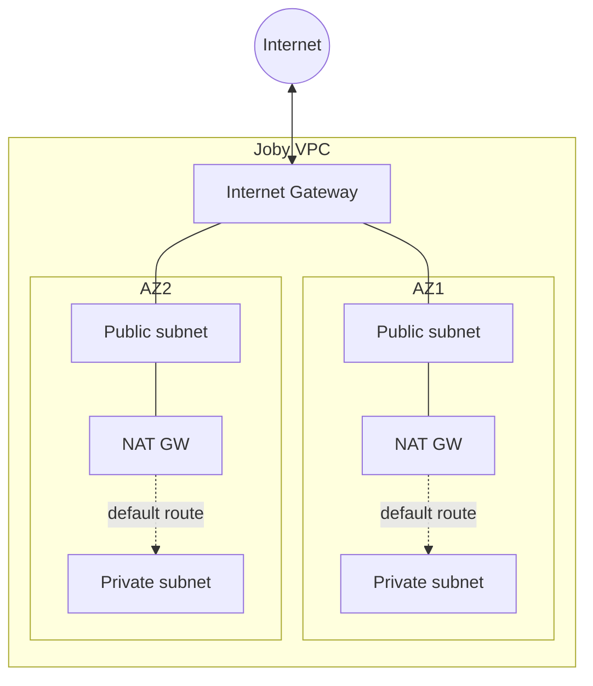
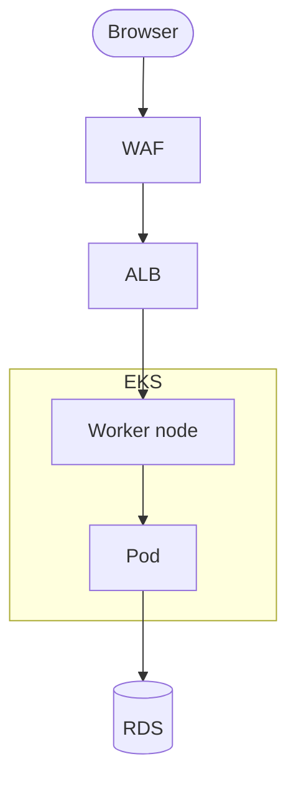
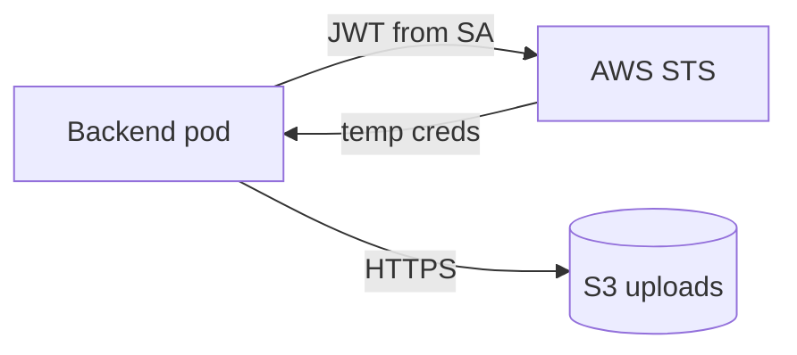
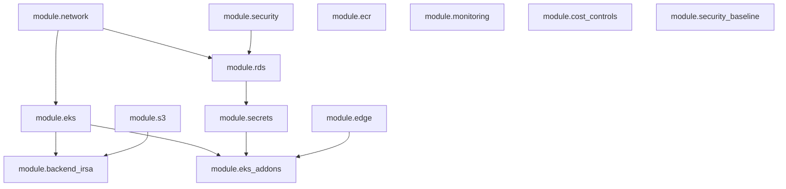

# Terraform Learning Guide (Joby Repository)

Welcome to the Terraform learning guide for the **Joby** application! If you are new to AWS or Terraform, you are in the right place. This document is designed to be an **absolute beginner-friendly** walkthrough of the infrastructure code in this repository. We will use plain English, real-world analogies, and diagrams to explain what everything is, why the Joby app needs it, and how it works under the hood.

> **Note:** Some sections below reference removed toggles (`single_nat_gateway`, `az_count`, `db_multi_az`, `enable_kubernetes_addons`, remote state, etc.). For current behavior, see [`README.md`](README.md).

### What are we building?

Before we dive into the code, let's understand the **Joby application**. Joby is a job board platform that involves users, profiles, resumes, and job applications. To run this app on the internet securely and reliably, we need several pieces:
- **A Frontend**: The website users see and interact with.
- **A Backend**: The API server that processes business logic (like saving a job application or parsing resumes).
- **A Database**: Where all the structured data (users, jobs, applications) is stored safely.
- **File Storage**: A place to save unstructured files, like user resumes or profile pictures.

This Terraform code is the blueprint that builds the "house" for the Joby app to live in on **AWS (Amazon Web Services)**.

### Terraform Basics (Quick Reminder & Analogy)

Imagine you want to build a real house. Instead of buying bricks and laying them yourself (which is like clicking around in the AWS website), you write a detailed **blueprint**. You give this blueprint to a construction crew (**Terraform**), and they build exactly what you drew on the cloud (AWS). If you update the blueprint to add a pool, the crew only builds the pool—they don't knock down and rebuild the whole house.

Here are the key "blueprint" keywords you will see in the code:
- **`variable`** = An input. Like telling the crew "paint the house *this* color", where you decide the exact color later.
- **`output`** = A result you can use. Like the crew giving you the "keys" to the front door after it's built so you can enter.
- **`resource`** = An actual thing being built in AWS. Like "build a database" or "create a server".
- **`module`** = A reusable mini-blueprint folder. Like a pre-designed "bathroom package" that you can plug into your main blueprint without redrawing the pipes every time.
- **`data`** = Looking up information that already exists. Like checking the local city zoning laws before building. It reads from AWS but doesn't build or change anything.
- **`locals`** = Computed values inside a module. Like saying "since the house name is 'Joby', prepend 'Joby' to all the room names" so you don't have to type it manually everywhere.

All the `.tf` files in a folder are **merged into one big blueprint** when Terraform reads them. The root `main.tf` file acts as the master coordinator, wiring all the mini-blueprints (`modules`) together.

---

**How to use this file:** Read the modules in order. Each section builds on the previous ones!

**The Learning Path:**

1. `modules/network` — The fenced property and roads (VPC, Subnets, NAT)
2. `modules/edge` — The front door and address (Route 53, ACM, WAF)
3. `modules/security` — The bouncers (Security Groups)
4. `modules/eks` — The compute engine (EKS Cluster & Nodes)
5. **Root Application Logs** — The diary (CloudWatch Logs)
6. `modules/s3` — The filing cabinet for files (S3 Bucket)
7. `modules/ecr` — The warehouse for our app code (ECR Repositories)
8. `modules/irsa` — The ID badges for our apps (IAM Roles for Service Accounts)
9. `modules/rds` — The filing cabinet for structured data (RDS PostgreSQL Database)
10. `modules/secrets` — The safe for passwords (Secrets Manager)
11. `modules/eks_addons` — The extra house features (Helm add-ons)
12. `modules/monitoring` — The security cameras and alarms (CloudWatch Alarms)
13. `modules/cost_controls` — The budget manager (AWS Budgets)
14. `modules/security_baseline` — The compliance officer (CloudTrail, GuardDuty)

### Glossary (read once; terms are reused everywhere)

| Term | Simple meaning | In this repo |
|------|----------------|---------------|
| **CIDR** | A range of private IP addresses written like `10.20.0.0/16` (network + mask). | `vpc_cidr`, subnet CIDR lists must fit inside the VPC CIDR. |
| **Availability Zone (AZ)** | A separate physical data center campus in one AWS Region. | Subnets are spread across `az_count` AZs for fault tolerance. |
| **Subnet** | A slice of the VPC’s IP space tied to one AZ. | Public subnets for NAT/ALB; private subnets for EKS nodes and RDS. |
| **Internet Gateway (IGW)** | The VPC’s attachment to the public internet for **inbound and outbound** traffic that uses public IPs. | Public subnets route `0.0.0.0/0` to the IGW. |
| **NAT Gateway** | Outbound-only path: private instances reach the internet using the NAT’s **public** IP; the internet cannot initiate connections back to private IPs. | Private route tables send default route to NAT, not IGW. |
| **VPC endpoint** | Private connection to an AWS API (S3, ECR, STS, …) **without** hairpinning traffic out to the public internet and back. **Hairpinning** = leaving the VPC to the internet just to reach AWS—slower and harder to lock down. | Gateway endpoint for S3; interface endpoints for ECR, Logs, Secrets Manager, SSM, STS, etc. |
| **Security Group (SG)** | A **stateful** virtual firewall on each ENI (network interface): **ingress** = who may connect in; **egress** = where traffic may go out. | RDS SG; EKS cluster/nodes SGs; VPC endpoints SG. |
| **NACL** | Subnet-level, **stateless** filter (not used in these modules). | If something fails, check SG + routes first, not NACLs. |
| **ENI** | Elastic network interface—what actually has an IP and SGs in a subnet. | Every EC2 instance and VPC endpoint interface has ENIs. |
| **ARN** | Amazon Resource Name—globally unique ID string for an AWS object. | IAM policies, Secrets Manager, Route 53 zone ARNs. |
| **OIDC** | OpenID Connect—protocol EKS uses so Kubernetes can issue **identity tokens** for workloads. | Registered in IAM for IRSA. |
| **IRSA** | IAM Roles for Service Accounts—bind one IAM role to one Kubernetes `ServiceAccount` using OIDC. | Backend S3 role in `modules/irsa`; add-on roles in `modules/eks_addons`. |
| **`count` / `count.index`** | Create `N` copies of a resource; `count.index` is `0..N-1`. | Subnets, NAT, route table associations. |
| **`for_each`** | Create one resource per key in a map/set. | ACM validation records; interface VPC endpoints per service name. |
| **`[*]` (splat)** | “All instances from a `count` resource” as a list. | `aws_subnet.public[*].id`, `aws_route_table.private[*].id`. |
| **`merge`** | Combine tag maps (later keys override earlier on conflict). | Almost every `tags = merge(var.tags, { ... })`. |
| **Dynamic map key** | `(local.cluster_tag_name) = "shared"` uses the **value** of `cluster_tag_name` as the map key. | Required for EKS subnet discovery tags. |

### How each module section is structured

1. **Plain English** — intuition only (short).
2. **Why Joby** — what part of the app or ops story needs this.
3. **Repo paths** — which files to open beside this guide.
4. **Inputs / outputs** — tables from `variables.tf` / `outputs.tf`.
5. **Code from the repo** — the real Terraform (or the exact root `module` block) so you can follow line numbers in Git.
6. **Walkthrough** — what **each block or line** does, why it exists, and how it connects to other modules or Kubernetes manifests under `k8s/eks/`.

> **Note on Removed Code:** Earlier versions of this repo included `modules/logging`, `modules/ec2`, and `modules/iam` (optional VM path). These were removed because the stack is now **EKS-only**. CloudFront was also removed; public traffic now goes directly to the ALB (Application Load Balancer) + regional WAF, with ExternalDNS managing the DNS records.

---

## Module 1: `modules/network`

### What is this? (Plain English)

A **VPC** is your private IP network in AWS. **Public subnets** can reach the internet through an **Internet Gateway** (and often get public IPs). **Private subnets** do not get a direct inbound path from the internet; outbound internet uses a **NAT Gateway** in a public subnet. **VPC endpoints** let private workloads call AWS APIs (S3, ECR, STS, …) on the AWS backbone instead of “hairpinning” out to the public internet and back.

### Why does Joby need it?

[EKS](https://docs.aws.amazon.com/eks/latest/userguide/what-is-eks.html) nodes and [RDS](https://docs.aws.amazon.com/AmazonRDS/latest/UserGuide/Welcome.html) are placed in **private** subnets. Public-facing **ALBs** (created later by Kubernetes + AWS Load Balancer Controller) use **public** subnets. Every other module needs `vpc_id`, subnet IDs, or private route table IDs from here.

### Repo paths

- [terraform/modules/network/main.tf](terraform/modules/network/main.tf) — all resources
- [terraform/modules/network/variables.tf](terraform/modules/network/variables.tf) — inputs
- [terraform/modules/network/outputs.tf](terraform/modules/network/outputs.tf) — exported IDs

### Root `module "network"` — full block and argument-by-argument

From [terraform/main.tf](terraform/main.tf):

```hcl
module "network" {
  source = "./modules/network"

  project_name            = var.project_name
  environment             = var.environment
  vpc_cidr                = var.vpc_cidr
  az_count                = var.az_count
  public_subnet_cidrs     = var.public_subnet_cidrs
  private_subnet_cidrs    = var.private_subnet_cidrs
  # NAT: one gateway per AZ (fixed at 3 AZs; single_nat_gateway removed)
  kubernetes_cluster_name = "${var.project_name}-${var.environment}-eks"
  tags                    = local.common_tags
}
```

| Argument | Meaning |
|----------|---------|
| `source` | Relative path to the child module folder; Terraform loads all `*.tf` there as one module. |
| `project_name` / `environment` | Passed through for naming and tags (e.g. `joby`, `prod`). |
| `vpc_cidr` | IPv4 CIDR for the whole VPC; all subnet CIDRs must be non-overlapping subsets. |
| `az_count` | How many AZs to span; must match subnet list lengths (validated in module). |
| `public_subnet_cidrs` | One CIDR per public subnet, length ≥ `az_count`. |
| `private_subnet_cidrs` | One CIDR per private subnet, length ≥ `az_count`. |
| `single_nat_gateway` | `true` = one NAT (cheaper, single point of failure); `false` = one NAT per AZ (default, more resilient). |
| `kubernetes_cluster_name` | **Must match** the EKS cluster name (`joby-prod-eks` pattern) so subnet tags satisfy the AWS Load Balancer Controller. |
| `tags` | `local.common_tags` from root (`Project`, `Environment`, `ManagedBy`) merged onto resources. |

### Module inputs (`variables.tf`)

| Variable | Type | Default / notes |
|----------|------|-----------------|
| `project_name` | string | Required. |
| `environment` | string | Required. |
| `vpc_cidr` | string | Default `10.20.0.0/16`. |
| `az_count` | number | Default `2`; **validation** requires 2 or 3. |
| `public_subnet_cidrs` | list(string) | Default three `/24` blocks; root/tfvars must supply at least `az_count` entries. |
| `private_subnet_cidrs` | list(string) | Default three `/24` blocks in a different range. |
| `single_nat_gateway` | bool | Default `false`. |
| `kubernetes_cluster_name` | string | Default `""`; root passes the real cluster name. |
| `tags` | map(string) | Default `{}`. |

### Module outputs (`outputs.tf`)

| Output | Value | Who consumes it |
|--------|-------|-----------------|
| `vpc_id` | `aws_vpc.this.id` | `module.eks`, `module.security`, VPC endpoints, etc. |
| `public_subnet_ids` | `aws_subnet.public[*].id` | ALB / NLB subnet discovery (public load balancers). |
| `private_subnet_ids` | `aws_subnet.private[*].id` | `module.eks` `subnet_ids`, `module.rds` `subnet_ids`. |
| `private_route_table_ids` | `aws_route_table.private[*].id` | S3 **gateway** endpoint `route_table_ids`. |

### Network diagram (mental model)



### Full module code (`modules/network/main.tf`)

This is the **actual** file in the repo (read it side-by-side with the walkthrough below).

```hcl
locals {
  name_prefix      = "${var.project_name}-${var.environment}"
  cluster_tag_name = var.kubernetes_cluster_name != "" ? "kubernetes.io/cluster/${var.kubernetes_cluster_name}" : ""
  cluster_tags     = var.kubernetes_cluster_name != "" ? { (local.cluster_tag_name) = "shared" } : {}

  interface_endpoint_services = [
    "ecr.api",
    "ecr.dkr",
    "logs",
    "secretsmanager",
    "ssm",
    "ssmmessages",
    "ec2messages",
    "sts",
  ]
}

data "aws_availability_zones" "available" {
  state = "available"
}

data "aws_region" "current" {}

resource "aws_vpc" "this" {
  cidr_block           = var.vpc_cidr
  enable_dns_hostnames = true
  enable_dns_support   = true

  tags = merge(var.tags, {
    Name = "${local.name_prefix}-vpc"
  })

  lifecycle {
    precondition {
      condition     = length(var.public_subnet_cidrs) >= var.az_count && length(var.private_subnet_cidrs) >= var.az_count
      error_message = "Provide at least one public and one private subnet CIDR per selected Availability Zone."
    }
  }
}

resource "aws_internet_gateway" "this" {
  vpc_id = aws_vpc.this.id

  tags = merge(var.tags, {
    Name = "${local.name_prefix}-igw"
  })
}

resource "aws_subnet" "public" {
  count = var.az_count

  vpc_id                  = aws_vpc.this.id
  cidr_block              = var.public_subnet_cidrs[count.index]
  availability_zone       = data.aws_availability_zones.available.names[count.index]
  map_public_ip_on_launch = true

  tags = merge(var.tags, local.cluster_tags, {
    Name                     = "${local.name_prefix}-public-${count.index + 1}"
    Tier                     = "public"
    "kubernetes.io/role/elb" = "1"
  })
}

resource "aws_subnet" "private" {
  count = var.az_count

  vpc_id            = aws_vpc.this.id
  cidr_block        = var.private_subnet_cidrs[count.index]
  availability_zone = data.aws_availability_zones.available.names[count.index]

  tags = merge(var.tags, local.cluster_tags, {
    Name                              = "${local.name_prefix}-private-${count.index + 1}"
    Tier                              = "private"
    "kubernetes.io/role/internal-elb" = "1"
  })
}

resource "aws_eip" "nat" {
  count = var.single_nat_gateway ? 1 : var.az_count

  domain = "vpc"

  tags = merge(var.tags, {
    Name = "${local.name_prefix}-nat-${count.index + 1}"
  })

  depends_on = [aws_internet_gateway.this]
}

resource "aws_nat_gateway" "this" {
  count = var.single_nat_gateway ? 1 : var.az_count

  allocation_id = aws_eip.nat[count.index].id
  subnet_id     = aws_subnet.public[var.single_nat_gateway ? 0 : count.index].id

  tags = merge(var.tags, {
    Name = "${local.name_prefix}-nat-${count.index + 1}"
  })

  depends_on = [aws_internet_gateway.this]
}

resource "aws_route_table" "public" {
  vpc_id = aws_vpc.this.id

  route {
    cidr_block = "0.0.0.0/0"
    gateway_id = aws_internet_gateway.this.id
  }

  tags = merge(var.tags, {
    Name = "${local.name_prefix}-public"
  })
}

resource "aws_route_table_association" "public" {
  count = var.az_count

  subnet_id      = aws_subnet.public[count.index].id
  route_table_id = aws_route_table.public.id
}

resource "aws_route_table" "private" {
  count = var.single_nat_gateway ? 1 : var.az_count

  vpc_id = aws_vpc.this.id

  route {
    cidr_block     = "0.0.0.0/0"
    nat_gateway_id = aws_nat_gateway.this[var.single_nat_gateway ? 0 : count.index].id
  }

  tags = merge(var.tags, {
    Name = "${local.name_prefix}-private-${count.index + 1}"
  })
}

resource "aws_route_table_association" "private" {
  count = var.az_count

  subnet_id      = aws_subnet.private[count.index].id
  route_table_id = aws_route_table.private[var.single_nat_gateway ? 0 : count.index].id
}

resource "aws_security_group" "vpc_endpoints" {
  name_prefix = "${local.name_prefix}-vpce-"
  description = "Interface VPC endpoint access from private workloads"
  vpc_id      = aws_vpc.this.id

  ingress {
    description = "HTTPS from VPC"
    from_port   = 443
    to_port     = 443
    protocol    = "tcp"
    cidr_blocks = [var.vpc_cidr]
  }

  egress {
    description = "All outbound traffic"
    from_port   = 0
    to_port     = 0
    protocol    = "-1"
    cidr_blocks = ["0.0.0.0/0"]
  }

  tags = merge(var.tags, {
    Name = "${local.name_prefix}-vpce"
  })
}

resource "aws_vpc_endpoint" "s3" {
  vpc_id            = aws_vpc.this.id
  service_name      = "com.amazonaws.${data.aws_region.current.name}.s3"
  vpc_endpoint_type = "Gateway"
  route_table_ids   = aws_route_table.private[*].id

  tags = merge(var.tags, {
    Name = "${local.name_prefix}-s3"
  })
}

resource "aws_vpc_endpoint" "interface" {
  for_each = toset(local.interface_endpoint_services)

  vpc_id              = aws_vpc.this.id
  service_name        = "com.amazonaws.${data.aws_region.current.name}.${each.key}"
  vpc_endpoint_type   = "Interface"
  subnet_ids          = aws_subnet.private[*].id
  security_group_ids  = [aws_security_group.vpc_endpoints.id]
  private_dns_enabled = true

  tags = merge(var.tags, {
    Name = "${local.name_prefix}-${replace(each.key, ".", "-")}"
  })
}
```

### Walkthrough — what each part does (read with the code above)

**`locals`**

- `name_prefix`: Human-readable prefix for `Name` tags (`joby-prod`).
- `cluster_tag_name` / `cluster_tags`: If `kubernetes_cluster_name` is set, subnets get tag `kubernetes.io/cluster/<name> = "shared"`. That tells the [AWS Load Balancer Controller](https://kubernetes-sigs.github.io/aws-load-balancer-controller/) these subnets are valid for **shared** load balancers for that cluster. The `(local.cluster_tag_name) = "shared"` syntax is a **dynamic map key** (the key string is computed).
- `interface_endpoint_services`: Hardcoded list (not a variable) so required AWS APIs are never accidentally omitted: ECR API/DKR, CloudWatch Logs, Secrets Manager, SSM/session channels, EC2 messages, STS.

**`data "aws_availability_zones"`**

- `state = "available"`: Only AZs AWS considers available for new resources—avoids hardcoding `us-east-1a`.

**`data "aws_region" "current"`**

- No arguments; exposes `data.aws_region.current.name` for regional service DNS names like `com.amazonaws.eu-west-1.s3`.

**`resource "aws_vpc" "this"`**

- `cidr_block`: The VPC’s primary IPv4 range.
- `enable_dns_hostnames` / `enable_dns_support`: Required for default VPC DNS resolution and many EKS/RDS patterns.
- `tags`: `merge` adds `Name`.
- `lifecycle.precondition`: **Plan-time** guard—fails `terraform plan` if subnet CIDR lists are shorter than `az_count` (prevents impossible layouts).

**`resource "aws_internet_gateway" "this"`**

- Attaches to the VPC; referenced by the public route table’s `0.0.0.0/0` route.

**`resource "aws_subnet" "public"`**

- `count = var.az_count`: Creates `public[0]`, `public[1]`, …
- `cidr_block`: Picks the matching list element per index.
- `availability_zone`: Pairs subnet with a real AZ name.
- `map_public_ip_on_launch = true`: New ENIs in this subnet can receive a public IPv4 (needed for NAT and public LBs).
- Tags: `kubernetes.io/role/elb = "1"` marks subnet for **internet-facing** load balancers.

**`resource "aws_subnet" "private"`**

- No `map_public_ip_on_launch` → instances do not get public IPs by default.
- `kubernetes.io/role/internal-elb = "1"` marks subnet for **internal** LBs if you add them later.

**`resource "aws_eip" "nat"`**

- `count`: One EIP if `single_nat_gateway`, else one per AZ.
- `domain = "vpc"`: Classic EIP in VPC scope (required for NAT).
- `depends_on = [aws_internet_gateway.this]`: AWS requires IGW attached before NAT/EIP in some edge cases.

**`resource "aws_nat_gateway" "this"`**

- `allocation_id`: Binds each NAT to its EIP.
- `subnet_id`: NAT lives in a **public** subnet; if single NAT, always `public[0]`, else one public subnet per AZ.
- Private subnets route `0.0.0.0/0` to NAT, so nodes can pull images/patches without public IPs.

**`resource "aws_route_table" "public"`**

- Single table: default route to **IGW** for all public subnets.

**`resource "aws_route_table_association" "public"`**

- Associates each `aws_subnet.public[i]` with the one public route table.

**`resource "aws_route_table" "private"`**

- `count`: One private table if single NAT, else one per AZ—each table’s default route targets the **matching** NAT (or NAT 0 when shared).

**`resource "aws_route_table_association" "private"`**

- Each private subnet uses `private[0]`’s route table when `single_nat_gateway`, else index-aligned table.

**`resource "aws_security_group" "vpc_endpoints"`**

- SG attached to **interface** VPC endpoints: ingress **443/tcp** only from `var.vpc_cidr` (entire VPC). Egress all (`-1` protocol) to `0.0.0.0/0` so endpoints can complete AWS-side connections.

**`resource "aws_vpc_endpoint" "s3"`**

- **Gateway** endpoint (no ENI): adds a route in each **private** route table (`aws_route_table.private[*].id`) so S3 prefix lists go over Amazon’s network.

**`resource "aws_vpc_endpoint" "interface"`**

- `for_each = toset(...)`: One endpoint per service string in `locals`.
- `service_name`: Regional DNS name `com.amazonaws.<region>.<service>`.
- `subnet_ids = aws_subnet.private[*].id`: Interface endpoints get ENIs in **every** private subnet (HA).
- `private_dns_enabled = true`: Resolves AWS API hostnames inside the VPC to private IPs.
- `replace(each.key, ".", "-")`: Tag `Name` cannot contain awkward dots from `ecr.api`.

### Syntax cheat sheet (this module)

| Pattern | Where used |
|---------|------------|
| `count` / `count.index` | Subnets, EIP, NAT, associations |
| Ternary `cond ? a : b` | NAT count, NAT subnet index, route table index |
| `[*]` splat | `aws_subnet.private[*].id`, `aws_route_table.private[*].id` |
| `for_each` / `each.key` | Interface VPC endpoints |
| `merge` | Tags everywhere |
| `lifecycle.precondition` | VPC subnet list lengths |
| `depends_on` | EIP/NAT after IGW |

### Common mistakes

1. **Subnet CIDRs too short for `az_count`** — plan fails at VPC precondition.
2. **Mismatch between `kubernetes_cluster_name` here and real EKS name** — ALB controller subnet discovery breaks.
3. **Thinking private subnets have no internet** — they have **outbound** via NAT; they just lack inbound from the internet.
4. **Forgetting S3 is gateway + interface list is fixed** — to add a service, edit `interface_endpoint_services` in code.

---

## Module 2: `modules/edge`

### What is this? (Plain English)

**Route 53** hosts your DNS zone and records. **ACM** issues the TLS certificate for HTTPS. **WAFv2** (this stack uses **REGIONAL** scope) attaches to an **Application Load Balancer** in the same region—**not** CloudFront. **ExternalDNS** (Helm chart in `modules/eks_addons`) creates the `A`/`ALIAS` record from `app_hostname` to the ALB after Ingress exists; this module does **not** create that application record.

### Why does Joby need it?

Users need a stable hostname, HTTPS, and baseline web protection. Outputs feed Kubernetes Ingress annotations (`certificate_arn`, `waf_web_acl_arn`) and ExternalDNS (`hosted_zone_arn`).

### Repo paths

- [terraform/modules/edge/main.tf](terraform/modules/edge/main.tf)
- [terraform/modules/edge/variables.tf](terraform/modules/edge/variables.tf)
- [terraform/modules/edge/outputs.tf](terraform/modules/edge/outputs.tf)

### Root `module "edge"` (from [terraform/main.tf](terraform/main.tf))

```hcl
module "edge" {
  source = "./modules/edge"

  project_name  = var.project_name
  environment   = var.environment
  domain_name   = var.domain_name
  app_subdomain = var.app_subdomain
  tags          = local.common_tags
}
```

| Argument | Meaning |
|----------|---------|
| `domain_name` | **Public** hosted zone apex, e.g. `example.com`. You delegate your registrar NS to `hosted_zone_name_servers` output. |
| `app_subdomain` | Default in variable is `app` → hostname `app.example.com`. Empty string uses apex only. |

### Module inputs

| Variable | Default | Notes |
|----------|---------|-------|
| `project_name` | — | Required. |
| `environment` | — | Required. |
| `domain_name` | — | Required; becomes Route 53 zone name. |
| `app_subdomain` | `"app"` | Can be set to `""` for apex-only hostname. |
| `tags` | `{}` | Merged on resources. |

### Module outputs

| Output | Meaning |
|--------|---------|
| `hosted_zone_id` / `hosted_zone_arn` | Zone identifiers; **ARN** passed to `eks_addons` as `route53_zone_arn`. |
| `hosted_zone_name_servers` | **Delegate** at your domain registrar. |
| `app_hostname` | FQDN for Ingress `host` and docs. |
| `certificate_arn` | From **`aws_acm_certificate_validation`**—use this (not raw cert) for listeners. |
| `waf_web_acl_arn` | Ingress annotation `alb.ingress.kubernetes.io/wafv2-acl-arn`. |
| `waf_web_acl_name` | **Name** (not ARN) for CloudWatch `AWS/WAFV2` metrics—see `modules/monitoring`. |

### Full module code (`modules/edge/main.tf`)

```hcl
locals {
  name_prefix  = "${var.project_name}-${var.environment}"
  app_hostname = var.app_subdomain == "" ? trimsuffix(var.domain_name, ".") : "${var.app_subdomain}.${trimsuffix(var.domain_name, ".")}"
}

resource "aws_route53_zone" "this" {
  name = var.domain_name

  tags = merge(var.tags, {
    Name = "${local.name_prefix}-zone"
  })
}

resource "aws_acm_certificate" "app" {
  domain_name       = local.app_hostname
  validation_method = "DNS"

  lifecycle {
    create_before_destroy = true
  }

  tags = merge(var.tags, {
    Name = "${local.name_prefix}-app"
  })
}

resource "aws_route53_record" "certificate_validation" {
  for_each = {
    for option in aws_acm_certificate.app.domain_validation_options : option.domain_name => {
      name   = option.resource_record_name
      record = option.resource_record_value
      type   = option.resource_record_type
    }
  }

  allow_overwrite = true
  name            = each.value.name
  records         = [each.value.record]
  ttl             = 60
  type            = each.value.type
  zone_id         = aws_route53_zone.this.zone_id
}

resource "aws_acm_certificate_validation" "app" {
  certificate_arn         = aws_acm_certificate.app.arn
  validation_record_fqdns = [for record in aws_route53_record.certificate_validation : record.fqdn]
}

resource "aws_wafv2_web_acl" "app" {
  name        = "${local.name_prefix}-app"
  description = "Managed protection for the ${var.project_name} public application"
  scope       = "REGIONAL"

  default_action {
    allow {}
  }

  rule {
    name     = "AWSManagedRulesCommonRuleSet"
    priority = 10

    override_action {
      none {}
    }

    statement {
      managed_rule_group_statement {
        name        = "AWSManagedRulesCommonRuleSet"
        vendor_name = "AWS"
      }
    }

    visibility_config {
      cloudwatch_metrics_enabled = true
      metric_name                = "${local.name_prefix}-common"
      sampled_requests_enabled   = true
    }
  }

  rule {
    name     = "AWSManagedRulesKnownBadInputsRuleSet"
    priority = 20

    override_action {
      none {}
    }

    statement {
      managed_rule_group_statement {
        name        = "AWSManagedRulesKnownBadInputsRuleSet"
        vendor_name = "AWS"
      }
    }

    visibility_config {
      cloudwatch_metrics_enabled = true
      metric_name                = "${local.name_prefix}-bad-inputs"
      sampled_requests_enabled   = true
    }
  }

  rule {
    name     = "AWSManagedRulesSQLiRuleSet"
    priority = 30

    override_action {
      none {}
    }

    statement {
      managed_rule_group_statement {
        name        = "AWSManagedRulesSQLiRuleSet"
        vendor_name = "AWS"
      }
    }

    visibility_config {
      cloudwatch_metrics_enabled = true
      metric_name                = "${local.name_prefix}-sqli"
      sampled_requests_enabled   = true
    }
  }

  rule {
    name     = "RateLimit"
    priority = 40

    action {
      block {}
    }

    statement {
      rate_based_statement {
        aggregate_key_type = "IP"
        limit              = 2000
      }
    }

    visibility_config {
      cloudwatch_metrics_enabled = true
      metric_name                = "${local.name_prefix}-rate-limit"
      sampled_requests_enabled   = true
    }
  }

  visibility_config {
    cloudwatch_metrics_enabled = true
    metric_name                = "${local.name_prefix}-waf"
    sampled_requests_enabled   = true
  }

  tags = var.tags
}
```

### Walkthrough

**`locals`**

- `name_prefix`: Used in tags and WAF metric names.
- `app_hostname`: `trimsuffix(var.domain_name, ".")` strips a trailing dot from zone input; ternary picks apex vs `subdomain.apex`.

**`aws_route53_zone.this`**

- Creates a **public** hosted zone for `domain_name`. NS records must be set at the registrar.

**`aws_acm_certificate.app`**

- `domain_name`: Only `local.app_hostname` is on this cert in this repo (no SAN list in code).
- `validation_method = "DNS"`: ACM returns CNAME records you must create to prove ownership.
- `lifecycle.create_before_destroy`: On replacement, new cert is created first to avoid TLS downtime during rotation.

**`aws_route53_record.certificate_validation`**

- `for_each = { for option in ... }`: Turns ACM’s `domain_validation_options` list into a **map** keyed by `domain_name` so each validation CNAME is one Terraform resource.
- `allow_overwrite = true`: Safe replans if records already exist.
- `ttl = 60`: Short TTL while validating; can be raised later for stability outside this guide’s scope.
- `zone_id`: Writes records into **this** module’s zone.

**`aws_acm_certificate_validation.app`**

- **Blocks** until ACM status is **ISSUED**. Downstream must use **`certificate_arn` from this resource’s attribute** (exposed via output as `aws_acm_certificate_validation.app.certificate_arn`).

**`aws_wafv2_web_acl.app`**

- `scope = "REGIONAL"`: Required for ALB attachment (vs `CLOUDFRONT` for CloudFront edge).
- `default_action.allow {}`: If no rule matches, allow (rules then add specific blocks).
- **Managed rule groups** (priorities 10–30): `override_action { none {} }` means “use the vendor rule group’s **internal** actions” (allow/block per rule inside the group)—not a blanket allow override.
- **RateLimit** (priority 40): `action.block {}` — explicit block. `rate_based_statement` with `aggregate_key_type = "IP"` and `limit = 2000` = max requests per 5 minutes **per source IP** before blocking (hardcoded security constant).
- **`visibility_config`**: Enables WAF metrics in CloudWatch per rule and top-level ACL.

### Syntax patterns

| Pattern | Example here |
|---------|----------------|
| `for` expression → map | ACM validation `for_each` |
| `[for r in ... : r.fqdn]` | List comprehension for validation FQDNs |
| `merge` | Tags on every resource |

### Common mistakes

1. **Expecting ACM in `us-east-1` for ALB** — not needed; regional cert matches ALB region.
2. **Using `aws_acm_certificate.app.arn` in Ingress** — prefer validated ARN from output (validation resource).
3. **WAF scope** — must stay `REGIONAL` for ALB; wrong scope cannot attach.

---

## Module 3: `modules/security`

### What is this? (Plain English)

One **security group** dedicated to **RDS**. SGs are **stateful**: if return traffic matches an established flow, it is allowed. This module defines the SG shell and **egress**; **PostgreSQL ingress** is attached at **root** so the rule can reference `module.eks.node_security_group_id` without creating a circular dependency inside the child module.

### Why does Joby need it?

RDS must accept **only** traffic from known application ENIs. Using **referenced_security_group_id** (not `0.0.0.0/0`) is least-privilege: only ENIs with the EKS **node** SG can open TCP 5432.

### Repo paths

- [terraform/modules/security/main.tf](terraform/modules/security/main.tf)
- [terraform/modules/security/variables.tf](terraform/modules/security/variables.tf)
- [terraform/modules/security/outputs.tf](terraform/modules/security/outputs.tf)
- Root rule: [terraform/main.tf](terraform/main.tf) `aws_vpc_security_group_ingress_rule.rds_from_eks_nodes`

### Root `module "security"`

```hcl
module "security" {
  source = "./modules/security"

  project_name = var.project_name
  environment  = var.environment
  vpc_id       = module.network.vpc_id
  tags         = local.common_tags
}
```

- `vpc_id`: SGs are **scoped to one VPC**; cannot attach to ENIs in another VPC.

### Full child module (`modules/security/main.tf`)

```hcl
resource "aws_security_group" "rds" {
  name_prefix = "${var.project_name}-${var.environment}-rds-"
  description = "Allows PostgreSQL access only from approved application security groups"
  vpc_id      = var.vpc_id

  egress {
    description = "All outbound traffic"
    from_port   = 0
    to_port     = 0
    protocol    = "-1"
    cidr_blocks = ["0.0.0.0/0"]
  }

  tags = merge(var.tags, {
    Name = "${var.project_name}-${var.environment}-rds"
  })

  lifecycle {
    create_before_destroy = true
  }
}
```

**Field-by-field**

| Line / block | Meaning |
|--------------|---------|
| `name_prefix` | AWS names the SG with an auto-suffix; avoids “name already in use” on replace. |
| `description` | Console/docs only; does not change behavior. |
| `vpc_id` | Which VPC’s ENIs may attach this SG. |
| `egress` `protocol = "-1"` | All protocols and ports outbound (RDS may need DNS, NTP, AWS APIs depending on features—here broad egress is typical). |
| `cidr_blocks = ["0.0.0.0/0"]` | Egress destination any IPv4 (stateful return still tied to sessions). |
| `tags` / `merge` | Standard `Name` tag plus caller tags. |
| `lifecycle.create_before_destroy` | On SG replacement, create new SG before destroy so dependent RDS can be repointed with less downtime risk in some change sequences. |

**No inline `ingress` blocks** — intentional; see root rule below.

### `outputs.tf`

```hcl
output "rds_security_group_id" {
  description = "Security group ID for the RDS instance"
  value       = aws_security_group.rds.id
}
```

`module.rds` passes this as `security_group_id`; root ingress rule uses the same output.

### Root-only ingress (`terraform/main.tf`)

```hcl
resource "aws_vpc_security_group_ingress_rule" "rds_from_eks_nodes" {
  security_group_id            = module.security.rds_security_group_id
  referenced_security_group_id = module.eks.node_security_group_id
  ip_protocol                  = "tcp"
  from_port                    = 5432
  to_port                      = 5432
  description                  = "PostgreSQL from EKS worker nodes"
}
```

| Attribute | Why it matters |
|-----------|----------------|
| `security_group_id` | **Target** SG (RDS side). |
| `referenced_security_group_id` | **Source** is any ENI that has this SG (here: worker nodes). Pods share the node’s network path for this pattern. |
| `ip_protocol` / `from_port` / `to_port` | PostgreSQL listens on **TCP 5432**. |
| Standalone resource vs inline rule | Modern style: one Terraform resource per rule; clearer diffs and avoids huge inline `ingress` blocks on `aws_security_group`. |

### Traffic mental model

```text
Internet → ALB/WAF → Pod on node (node SG) → RDS ENI (RDS SG allows 5432 from node SG)
```

### Common mistakes

1. **Expecting RDS ingress inside `modules/security`** — it is at root by design.
2. **Forgetting `rds_from_eks_nodes`** — RDS would have no ingress and apps would timeout.
3. **Opening RDS to `10.0.0.0/8`** — wider than needed; this repo uses SG-to-SG reference instead.

---

## Module 4: `modules/eks`

### What is this? (Plain English)

**Amazon EKS** runs Kubernetes: AWS operates the **control plane** (API server, etcd, schedulers); you operate **worker nodes** (EC2) via a **managed node group**. This module also registers the cluster **OIDC issuer** in IAM so **IRSA** can work, and installs **EKS managed add-ons** (CoreDNS, vpc-cni, etc.)—different from **Helm** add-ons in `modules/eks_addons`.

### Why does Joby need it?

Containers for the Joby API and UI run here. Outputs power `kubernetes`/`helm` providers, `backend_irsa`, `eks_addons`, and monitoring.

### Repo paths

- [terraform/modules/eks/main.tf](terraform/modules/eks/main.tf)
- [terraform/modules/eks/variables.tf](terraform/modules/eks/variables.tf)
- [terraform/modules/eks/outputs.tf](terraform/modules/eks/outputs.tf)

### Root `module "eks"` (complete arguments)

From [terraform/main.tf](terraform/main.tf):

```hcl
module "eks" {
  source = "./modules/eks"

  project_name                    = var.project_name
  environment                     = var.environment
  cluster_version                 = var.eks_cluster_version
  subnet_ids                      = module.network.private_subnet_ids
  vpc_id                          = module.network.vpc_id
  node_instance_types             = var.eks_node_instance_types
  node_desired_size               = var.eks_node_desired_size
  node_min_size                   = var.eks_node_min_size
  node_max_size                   = var.eks_node_max_size
  cluster_endpoint_public_access  = var.eks_cluster_endpoint_public_access
  cluster_endpoint_private_access = var.eks_cluster_endpoint_private_access
  cluster_public_access_cidrs     = var.eks_cluster_public_access_cidrs
  tags                            = local.common_tags
}
```

| Argument | Role |
|----------|------|
| `subnet_ids` | **Private** subnets only—cluster ENIs and nodes share this list. |
| `vpc_id` | For **security groups** (cluster + nodes); not a separate top-level field on `aws_eks_cluster`. |
| `cluster_endpoint_public_access` | Whether `kubectl`/API can reach the internet-facing endpoint (defaults in module favor **false**). |
| `cluster_endpoint_private_access` | API reachable from inside VPC (default **true**). |
| `cluster_public_access_cidrs` | When public access is on, restrict source CIDRs. |

### Module variables (defaults from `variables.tf`)

| Variable | Default | Meaning |
|----------|---------|---------|
| `cluster_version` | `"1.30"` | Kubernetes control plane version. |
| `node_instance_types` | `["t3.medium"]` | EC2 types the node group may use. |
| `node_desired_size` / `min` / `max` | `2` / `2` / `4` | ASG behind the node group. |
| `enabled_cluster_log_types` | api, audit, authenticator, controllerManager, scheduler | Control plane → CloudWatch Logs (separate from root app log group). |
| `cluster_addons` | set of addon names | Passed to `aws_eks_addon` `for_each`. |

### Module outputs

| Output | Consumer |
|--------|----------|
| `cluster_name` | `aws eks get-token`, autoscaler, monitoring |
| `cluster_endpoint` / `cluster_certificate_authority_data` | `kubernetes` + `helm` provider in `providers.tf` |
| `cluster_oidc_issuer_url` / `oidc_provider_arn` | `modules/irsa`, `modules/eks_addons` trust policies |
| `node_security_group_id` | Root `rds_from_eks_nodes` |

### Traffic diagram



### Full module code (`modules/eks/main.tf`)

The file below is the **authoritative** source—read it in the repo while you read the walkthrough.

```hcl
locals {
  cluster_name = "${var.project_name}-${var.environment}-eks"
}

data "aws_iam_policy_document" "cluster_assume_role" {
  statement {
    actions = ["sts:AssumeRole"]
    principals {
      type        = "Service"
      identifiers = ["eks.amazonaws.com"]
    }
  }
}

resource "aws_iam_role" "cluster" {
  name               = "${local.cluster_name}-cluster-role"
  assume_role_policy = data.aws_iam_policy_document.cluster_assume_role.json
  tags               = var.tags
}

resource "aws_iam_role_policy_attachment" "cluster_policy" {
  role       = aws_iam_role.cluster.name
  policy_arn = "arn:aws:iam::aws:policy/AmazonEKSClusterPolicy"
}

resource "aws_security_group" "cluster" {
  name_prefix = "${local.cluster_name}-cluster-"
  description = "EKS control plane security group"
  vpc_id      = var.vpc_id

  egress {
    from_port   = 0
    to_port     = 0
    protocol    = "-1"
    cidr_blocks = ["0.0.0.0/0"]
  }

  tags = merge(var.tags, {
    Name = "${local.cluster_name}-cluster-sg"
  })
}

resource "aws_security_group" "nodes" {
  name_prefix = "${local.cluster_name}-nodes-"
  description = "EKS worker node security group"
  vpc_id      = var.vpc_id

  ingress {
    from_port = 0
    to_port   = 0
    protocol  = "-1"
    self      = true
  }

  ingress {
    description     = "Control plane to nodes"
    from_port       = 0
    to_port         = 0
    protocol        = "-1"
    security_groups = [aws_security_group.cluster.id]
  }

  egress {
    from_port   = 0
    to_port     = 0
    protocol    = "-1"
    cidr_blocks = ["0.0.0.0/0"]
  }

  tags = merge(var.tags, {
    Name = "${local.cluster_name}-nodes-sg"
  })
}

resource "aws_vpc_security_group_ingress_rule" "cluster_from_nodes_https" {
  security_group_id            = aws_security_group.cluster.id
  referenced_security_group_id = aws_security_group.nodes.id
  ip_protocol                  = "tcp"
  from_port                    = 443
  to_port                      = 443
  description                  = "Kubernetes API from worker nodes"
}

resource "aws_eks_cluster" "this" {
  name                      = local.cluster_name
  role_arn                  = aws_iam_role.cluster.arn
  version                   = var.cluster_version
  enabled_cluster_log_types = var.enabled_cluster_log_types

  vpc_config {
    subnet_ids              = var.subnet_ids
    endpoint_public_access  = var.cluster_endpoint_public_access
    endpoint_private_access = var.cluster_endpoint_private_access
    public_access_cidrs     = var.cluster_public_access_cidrs
    security_group_ids      = [aws_security_group.cluster.id]
  }

  tags = var.tags

  depends_on = [
    aws_iam_role_policy_attachment.cluster_policy
  ]
}

data "tls_certificate" "cluster" {
  url = aws_eks_cluster.this.identity[0].oidc[0].issuer
}

resource "aws_iam_openid_connect_provider" "cluster" {
  client_id_list  = ["sts.amazonaws.com"]
  thumbprint_list = [data.tls_certificate.cluster.certificates[0].sha1_fingerprint]
  url             = aws_eks_cluster.this.identity[0].oidc[0].issuer

  tags = var.tags
}

resource "aws_eks_addon" "this" {
  for_each = var.cluster_addons

  cluster_name                = aws_eks_cluster.this.name
  addon_name                  = each.value
  resolve_conflicts_on_create = "OVERWRITE"
  resolve_conflicts_on_update = "OVERWRITE"

  depends_on = [
    aws_eks_node_group.this
  ]
}

data "aws_iam_policy_document" "nodes_assume_role" {
  statement {
    actions = ["sts:AssumeRole"]
    principals {
      type        = "Service"
      identifiers = ["ec2.amazonaws.com"]
    }
  }
}

resource "aws_iam_role" "nodes" {
  name               = "${local.cluster_name}-node-role"
  assume_role_policy = data.aws_iam_policy_document.nodes_assume_role.json
  tags               = var.tags
}

resource "aws_iam_role_policy_attachment" "nodes_worker_policy" {
  role       = aws_iam_role.nodes.name
  policy_arn = "arn:aws:iam::aws:policy/AmazonEKSWorkerNodePolicy"
}

resource "aws_iam_role_policy_attachment" "nodes_ecr_policy" {
  role       = aws_iam_role.nodes.name
  policy_arn = "arn:aws:iam::aws:policy/AmazonEC2ContainerRegistryReadOnly"
}

resource "aws_iam_role_policy_attachment" "nodes_cni_policy" {
  role       = aws_iam_role.nodes.name
  policy_arn = "arn:aws:iam::aws:policy/AmazonEKS_CNI_Policy"
}

resource "aws_iam_role_policy_attachment" "nodes_cloudwatch_policy" {
  role       = aws_iam_role.nodes.name
  policy_arn = "arn:aws:iam::aws:policy/CloudWatchAgentServerPolicy"
}

resource "aws_iam_role_policy_attachment" "nodes_ebs_csi_policy" {
  role       = aws_iam_role.nodes.name
  policy_arn = "arn:aws:iam::aws:policy/service-role/AmazonEBSCSIDriverPolicy"
}

resource "aws_launch_template" "nodes" {
  name_prefix            = "${local.cluster_name}-nodes-"
  vpc_security_group_ids = [aws_security_group.nodes.id]

  metadata_options {
    http_endpoint = "enabled"
    http_tokens   = "required"
  }

  tag_specifications {
    resource_type = "instance"

    tags = merge(var.tags, {
      Name = "${local.cluster_name}-node"
    })
  }

  tag_specifications {
    resource_type = "volume"

    tags = merge(var.tags, {
      Name = "${local.cluster_name}-node-volume"
    })
  }

  tags = var.tags
}

resource "aws_eks_node_group" "this" {
  cluster_name    = aws_eks_cluster.this.name
  node_group_name = "${var.project_name}-${var.environment}-ng"
  node_role_arn   = aws_iam_role.nodes.arn
  subnet_ids      = var.subnet_ids
  instance_types  = var.node_instance_types

  scaling_config {
    desired_size = var.node_desired_size
    min_size     = var.node_min_size
    max_size     = var.node_max_size
  }

  launch_template {
    id      = aws_launch_template.nodes.id
    version = aws_launch_template.nodes.latest_version
  }

  update_config {
    max_unavailable = 1
  }

  tags = merge(var.tags, {
    "k8s.io/cluster-autoscaler/enabled"               = "true"
    "k8s.io/cluster-autoscaler/${local.cluster_name}" = "owned"
  })

  depends_on = [
    aws_iam_role_policy_attachment.nodes_worker_policy,
    aws_iam_role_policy_attachment.nodes_ecr_policy,
    aws_iam_role_policy_attachment.nodes_cni_policy,
    aws_iam_role_policy_attachment.nodes_cloudwatch_policy,
    aws_iam_role_policy_attachment.nodes_ebs_csi_policy
  ]
}
```

### Walkthrough (block by block)

1. **`locals.cluster_name`** — Single string used everywhere (`joby-prod-eks`); must stay consistent with `module.network`’s `kubernetes_cluster_name` input.

2. **Cluster IAM** — `data.aws_iam_policy_document.cluster_assume_role` allows only `eks.amazonaws.com` to assume `aws_iam_role.cluster`. `AmazonEKSClusterPolicy` attachment grants control-plane operations. `depends_on` on `aws_eks_cluster` ensures the attachment exists before create.

3. **`aws_security_group.cluster`** — Attached to **control plane ENIs** via `vpc_config.security_group_ids`. Egress-only inside the `aws_security_group` resource; **nodes → API on 443** is added by `aws_vpc_security_group_ingress_rule.cluster_from_nodes_https`.

4. **`aws_security_group.nodes`** — On worker ENIs: **self** ingress (all protocols) for node-to-node/CNI traffic; **ingress from cluster SG** for control plane → kubelet paths; egress all.

5. **`aws_eks_cluster.this`** — `enabled_cluster_log_types` ships selected control plane logs to CloudWatch (different log groups than root `aws_cloudwatch_log_group.app`). `vpc_config` pins API networking and cluster SG.

6. **OIDC** — `data.tls_certificate` fetches the issuer cert; `thumbprint_list` is required for `aws_iam_openid_connect_provider`. `client_id_list = ["sts.amazonaws.com"]` is the standard IRSA audience.

7. **`aws_eks_addon.this`** — `for_each` over `set(string)` creates one `aws_eks_addon` per name; `each.value` is the addon name string. `resolve_conflicts_on_* = "OVERWRITE"` tells EKS to prefer addon-managed fields on drift. `depends_on` node group ensures workers exist before addons that need nodes.

8. **Node IAM** — `ec2.amazonaws.com` assume role; five AWS-managed policy attachments: worker, ECR pull, VPC CNI, CloudWatch agent, EBS CSI.

9. **`aws_launch_template.nodes`** — Attaches **nodes** SG; `http_tokens = "required"` enforces **IMDSv2** (mitigates SSRF stealing instance creds). `tag_specifications` propagate tags to instances and root EBS volumes.

10. **`aws_eks_node_group.this`** — Uses `launch_template.latest_version` so template updates roll forward. `update_config.max_unavailable = 1` limits concurrent node loss during upgrades. Autoscaler tags match `cluster_autoscaler` IAM condition in `eks_addons`.

### Apply order (simplified)

```text
cluster IAM + attachment → cluster SG + nodes SG + 443 rule → aws_eks_cluster
  → tls_certificate + OIDC provider → node IAM + attachments → launch template
  → aws_eks_node_group → aws_eks_addon (for_each)
```

### Common mistakes

1. **Helm add-ons vs `aws_eks_addon`** — ALB controller lives in `eks_addons`, not here.
2. **Public API vs public website** — `cluster_endpoint_public_access` is **Kubernetes API** reachability, not user HTTP traffic.
3. **IRSA vs node role** — S3 app access is `modules/irsa`; nodes still need ECR read for image pulls.

---

## Module 5: Root application CloudWatch log group

### What is this?

A **CloudWatch Logs log group** is a named stream container for log events. Root [terraform/main.tf](terraform/main.tf) defines **`aws_cloudwatch_log_group.app`** (the old `modules/logging` folder was removed).

### Why Joby needs it

Application stdout/stderr (or agents shipping logs) can target this group name. **`modules/monitoring`** creates **metric filters** on this group’s name for `ERROR` / `WARN` substrings.

### Related root resources (same `main.tf`)

**`random_id.suffix`** (root) — `byte_length = 4` → 8 hex chars used in **default** S3 bucket name when `var.s3_bucket_name` is empty:

```hcl
resource "random_id" "suffix" {
  byte_length = 4
}

locals {
  s3_bucket_name = var.s3_bucket_name != "" ? var.s3_bucket_name : "${var.project_name}-${var.environment}-uploads-${random_id.suffix.hex}"
  common_tags = { ... }
}
```

**`aws_cloudwatch_log_group.app`**

```hcl
resource "aws_cloudwatch_log_group" "app" {
  name              = "/${var.project_name}/${var.environment}"
  retention_in_days = 7
  tags              = local.common_tags
}
```

| Attribute | Meaning |
|-----------|---------|
| `name` | Log group path, e.g. `/joby/prod`. Anything writing logs must use this exact string (or you update monitoring inputs). |
| `retention_in_days` | After 7 days AWS **deletes** log events—cost control; raise for stricter audit needs. |
| `tags` | Same `Project` / `Environment` / `ManagedBy` as other resources. |

**Not the same as** EKS control plane logs: those come from `enabled_cluster_log_types` on `aws_eks_cluster` in `modules/eks` into AWS-managed log group names under `/aws/eks/...`.

**Consumers:** `module.monitoring` input `application_log_group_name = aws_cloudwatch_log_group.app.name`; root `outputs.tf` may expose `cloudwatch_log_group`.

---

## Module 6: `modules/s3`

### What is this?

Private **S3** bucket for **user uploads** with versioning, SSE-S3 encryption, public access block, TLS-only bucket policy, ownership controls, and lifecycle rules.

### Repo file

[terraform/modules/s3/main.tf](terraform/modules/s3/main.tf) — complete file below.

### Root wiring

```hcl
module "s3" {
  source      = "./modules/s3"
  bucket_name = local.s3_bucket_name
  tags        = local.common_tags
}
```

### Full `modules/s3/main.tf` (repo)

```hcl
resource "aws_s3_bucket" "uploads" {
  bucket = var.bucket_name
  tags   = var.tags
}

resource "aws_s3_bucket_versioning" "uploads" {
  bucket = aws_s3_bucket.uploads.id

  versioning_configuration {
    status = "Enabled"
  }
}

resource "aws_s3_bucket_server_side_encryption_configuration" "uploads" {
  bucket = aws_s3_bucket.uploads.id

  rule {
    apply_server_side_encryption_by_default {
      sse_algorithm = "AES256"
    }
    bucket_key_enabled = true
  }
}

resource "aws_s3_bucket_public_access_block" "uploads" {
  bucket = aws_s3_bucket.uploads.id

  block_public_acls       = true
  block_public_policy     = true
  ignore_public_acls      = true
  restrict_public_buckets = true
}

data "aws_iam_policy_document" "uploads" {
  statement {
    sid     = "DenyInsecureTransport"
    effect  = "Deny"
    actions = ["s3:*"]

    principals {
      type        = "*"
      identifiers = ["*"]
    }

    resources = [
      aws_s3_bucket.uploads.arn,
      "${aws_s3_bucket.uploads.arn}/*",
    ]

    condition {
      test     = "Bool"
      variable = "aws:SecureTransport"
      values   = ["false"]
    }
  }
}

resource "aws_s3_bucket_policy" "uploads" {
  bucket = aws_s3_bucket.uploads.id
  policy = data.aws_iam_policy_document.uploads.json

  depends_on = [aws_s3_bucket_public_access_block.uploads]
}

resource "aws_s3_bucket_ownership_controls" "uploads" {
  bucket = aws_s3_bucket.uploads.id

  rule {
    object_ownership = "BucketOwnerEnforced"
  }
}

resource "aws_s3_bucket_lifecycle_configuration" "uploads" {
  bucket = aws_s3_bucket.uploads.id

  rule {
    id     = "expire-noncurrent-uploads"
    status = "Enabled"

    filter {
      prefix = ""
    }

    noncurrent_version_expiration {
      noncurrent_days = 30
    }

    abort_incomplete_multipart_upload {
      days_after_initiation = 7
    }
  }
}
```

### Walkthrough

1. **`aws_s3_bucket.uploads`** — Base bucket only (provider v4+ splits settings into separate resources).

2. **`aws_s3_bucket_versioning`** — `Enabled`: every overwrite creates a new version; pairs with lifecycle `noncurrent_version_expiration`.

3. **`aws_s3_bucket_server_side_encryption_configuration`** — **SSE-S3** (`AES256`); `bucket_key_enabled` reduces cost when using KMS-heavy patterns (here SSE-S3 is still valid with bucket key flag per AWS/Terraform docs).

4. **`aws_s3_bucket_public_access_block`** — All four `true`: blocks ACL-based and policy-based public exposure and ignores public ACLs on objects.

5. **`data.aws_iam_policy_document.uploads`** — **Deny** all `s3:*` when `aws:SecureTransport` is false → rejects plain HTTP API calls; principals `*` with Deny is a common “secure transport only” pattern.

6. **`aws_s3_bucket_policy.uploads`** — Attaches JSON; `depends_on` public access block avoids race on first create.

7. **`aws_s3_bucket_ownership_controls`** — `BucketOwnerEnforced`: disables legacy ACL object ownership; IAM/policy only.

8. **`aws_s3_bucket_lifecycle_configuration`** — `filter { prefix = "" }` applies rule to whole bucket; expires **noncurrent** versions after 30 days; aborts stalled multipart uploads after 7 days.

**Downstream:** `module.backend_irsa` takes `module.s3.bucket_arn` for IAM `resources`.

### Common mistakes

- Expecting `force_destroy` on the bucket — not set; empty bucket manually before destroy if needed.
- Serving public objects — design is private + app/IRSA or presigned URLs.

---

## Module 7: `modules/ecr`

### What is this?

**Amazon ECR** stores OCI/container images. This module creates **two** repositories named **`${project}-${environment}-backend`** and **`${project}-${environment}-frontend`** (see [terraform/modules/ecr/main.tf](terraform/modules/ecr/main.tf)—names are **hardcoded** suffixes `backend` / `frontend`, not extra variables).

### Full `modules/ecr/main.tf`

```hcl
resource "aws_ecr_repository" "backend" {
  name                 = "${var.project_name}-${var.environment}-backend"
  image_tag_mutability = "IMMUTABLE"

  image_scanning_configuration {
    scan_on_push = true
  }

  encryption_configuration {
    encryption_type = "AES256"
  }

  tags = var.tags
}

resource "aws_ecr_repository" "frontend" {
  name                 = "${var.project_name}-${var.environment}-frontend"
  image_tag_mutability = "IMMUTABLE"

  image_scanning_configuration {
    scan_on_push = true
  }

  encryption_configuration {
    encryption_type = "AES256"
  }

  tags = var.tags
}

resource "aws_ecr_lifecycle_policy" "backend" {
  repository = aws_ecr_repository.backend.name

  policy = jsonencode({
    rules = [
      {
        rulePriority = 1
        description  = "Expire untagged images after 14 days"
        selection = {
          tagStatus   = "untagged"
          countType   = "sinceImagePushed"
          countUnit   = "days"
          countNumber = 14
        }
        action = {
          type = "expire"
        }
      }
    ]
  })
}

resource "aws_ecr_lifecycle_policy" "frontend" {
  repository = aws_ecr_repository.frontend.name

  policy = jsonencode({
    rules = [
      {
        rulePriority = 1
        description  = "Expire untagged images after 14 days"
        selection = {
          tagStatus   = "untagged"
          countType   = "sinceImagePushed"
          countUnit   = "days"
          countNumber = 14
        }
        action = {
          type = "expire"
        }
      }
    ]
  })
}
```

### Walkthrough

- **`image_tag_mutability = "IMMUTABLE"`** — You cannot move tag `v1` to another digest; production deploys use new tags (e.g. Git SHA).
- **`scan_on_push`** — Basic image scanning on push.
- **`encryption_configuration`** — AES256 at rest.
- **`jsonencode` lifecycle** — Untagged images older than **14 days** expire; **tagged** images are not removed by this rule.

**Consumers:** CI pushes to repository URLs; EKS node role has `AmazonEC2ContainerRegistryReadOnly` for pulls.

---

## Module 8: `modules/irsa`

### What is this?

**IRSA** binds one IAM role to one Kubernetes `ServiceAccount` via the cluster OIDC issuer. [terraform/modules/irsa/main.tf](terraform/modules/irsa/main.tf) grants **S3** List/Get/Put/Delete on the uploads bucket ARN only.

### Root `module "backend_irsa"`

```hcl
module "backend_irsa" {
  source = "./modules/irsa"

  project_name         = var.project_name
  environment          = var.environment
  oidc_provider_arn    = module.eks.oidc_provider_arn
  oidc_provider_url    = module.eks.cluster_oidc_issuer_url
  namespace            = var.k8s_namespace
  service_account_name = var.backend_service_account_name
  s3_bucket_arn        = module.s3.bucket_arn
  tags                 = local.common_tags
}
```

### Full `modules/irsa/main.tf`

```hcl
locals {
  oidc_provider = replace(var.oidc_provider_url, "https://", "")
  role_name     = "${var.project_name}-${var.environment}-${var.service_account_name}"
}

data "aws_iam_policy_document" "assume_role" {
  statement {
    actions = ["sts:AssumeRoleWithWebIdentity"]

    principals {
      type        = "Federated"
      identifiers = [var.oidc_provider_arn]
    }

    condition {
      test     = "StringEquals"
      variable = "${local.oidc_provider}:aud"
      values   = ["sts.amazonaws.com"]
    }

    condition {
      test     = "StringEquals"
      variable = "${local.oidc_provider}:sub"
      values   = ["system:serviceaccount:${var.namespace}:${var.service_account_name}"]
    }
  }
}

resource "aws_iam_role" "this" {
  name               = local.role_name
  assume_role_policy = data.aws_iam_policy_document.assume_role.json
  tags               = var.tags
}

data "aws_iam_policy_document" "s3_access" {
  statement {
    sid       = "ListUploadsBucket"
    actions   = ["s3:ListBucket"]
    resources = [var.s3_bucket_arn]
  }

  statement {
    sid = "ManageUploadObjects"
    actions = [
      "s3:GetObject",
      "s3:PutObject",
      "s3:DeleteObject",
    ]
    resources = ["${var.s3_bucket_arn}/*"]
  }
}

resource "aws_iam_role_policy" "s3_access" {
  name   = "${local.role_name}-s3-access"
  role   = aws_iam_role.this.id
  policy = data.aws_iam_policy_document.s3_access.json
}
```

### Walkthrough

- **`replace(..., "https://", "")`** — IAM OIDC condition keys use issuer **without** scheme.
- **`AssumeRoleWithWebIdentity`** — Pods call STS with projected JWT; not `AssumeRole` with long-lived keys.
- **`:aud` / `:sub` conditions** — Standard EKS IRSA audience; `sub` must match **exactly** `system:serviceaccount:<ns>:<sa>`.
- **`ListBucket`** on bucket ARN; object APIs on `arn/*` — IAM requires this split.

### Kubernetes wiring (same repo)

[k8s/eks/serviceaccount.yaml](k8s/eks/serviceaccount.yaml) — annotation `eks.amazonaws.com/role-arn` must equal Terraform output `backend_irsa_role_arn` (replace placeholder). [k8s/eks/backend.yaml](k8s/eks/backend.yaml) sets `serviceAccountName` so only backend pods get the projected token.

### IRSA diagram



### Common mistakes

- Namespace/SA name mismatch with trust `sub`.
- Expecting this role to read **Secrets Manager** — that is **External Secrets** IRSA in `eks_addons`.

---

## Module 9: `modules/rds`

### What is this?

**Amazon RDS** runs PostgreSQL for you: AWS handles engine maintenance, automated backups (when retention > 0), storage scaling, and optional **Multi-AZ** synchronous standby.

### Why Joby needs it

Users, jobs, applications, and metadata live as **rows** in PostgreSQL. S3 holds blobs (resumes); RDS holds the relational truth.

### Root wiring ([terraform/main.tf](terraform/main.tf))

```hcl
module "rds" {
  source = "./modules/rds"

  project_name            = var.project_name
  environment             = var.environment
  subnet_ids              = module.network.private_subnet_ids
  security_group_id       = module.security.rds_security_group_id
  db_name                 = var.db_name
  db_username             = var.db_username
  db_password             = var.db_password
  instance_class          = var.db_instance_class
  allocated_storage       = var.db_allocated_storage
  max_allocated_storage   = var.db_max_allocated_storage
  multi_az                = var.db_multi_az
  skip_final_snapshot     = var.db_skip_final_snapshot
  deletion_protection     = var.db_deletion_protection
  backup_retention_period = var.db_backup_retention_period
  tags                    = local.common_tags
}
```

- **`subnet_ids`** — Must be **private** subnets with routes to the same network path your apps use (NAT or VPC endpoints) if apps need to reach RDS from the cluster.
- **`security_group_id`** — The RDS SG from `module.security` only **allows** what its rules say; the **5432 from EKS nodes** rule is **not** inside this module—it is root `aws_vpc_security_group_ingress_rule.rds_from_eks_nodes` so Terraform can reference `module.eks.node_security_group_id`.

### Full [terraform/modules/rds/main.tf](terraform/modules/rds/main.tf)

```hcl
resource "aws_db_subnet_group" "this" {
  name       = "${var.project_name}-${var.environment}"
  subnet_ids = var.subnet_ids

  tags = merge(var.tags, {
    Name = "${var.project_name}-${var.environment}-db-subnet-group"
  })
}

resource "random_id" "final_snapshot" {
  byte_length = 4
}

data "aws_iam_policy_document" "enhanced_monitoring_assume_role" {
  statement {
    actions = ["sts:AssumeRole"]

    principals {
      type        = "Service"
      identifiers = ["monitoring.rds.amazonaws.com"]
    }
  }
}

resource "aws_iam_role" "enhanced_monitoring" {
  name               = "${var.project_name}-${var.environment}-rds-monitoring"
  assume_role_policy = data.aws_iam_policy_document.enhanced_monitoring_assume_role.json
  tags               = var.tags
}

resource "aws_iam_role_policy_attachment" "enhanced_monitoring" {
  role       = aws_iam_role.enhanced_monitoring.name
  policy_arn = "arn:aws:iam::aws:policy/service-role/AmazonRDSEnhancedMonitoringRole"
}

resource "aws_db_instance" "this" {
  identifier = "${var.project_name}-${var.environment}"

  engine           = "postgres"
  engine_version   = "16"
  instance_class   = var.instance_class

  allocated_storage     = var.allocated_storage
  max_allocated_storage = var.max_allocated_storage
  storage_type          = "gp3"
  storage_encrypted     = true

  db_name  = var.db_name
  username = var.db_username
  password = var.db_password

  db_subnet_group_name   = aws_db_subnet_group.this.name
  vpc_security_group_ids = [var.security_group_id]
  publicly_accessible    = false
  multi_az               = var.multi_az

  backup_retention_period         = var.backup_retention_period
  backup_window                   = "03:00-04:00"
  maintenance_window              = "sun:04:30-sun:05:30"
  auto_minor_version_upgrade      = true
  enabled_cloudwatch_logs_exports = ["postgresql", "upgrade"]

  skip_final_snapshot       = var.skip_final_snapshot
  final_snapshot_identifier = var.skip_final_snapshot ? null : "${var.project_name}-${var.environment}-final-${random_id.final_snapshot.hex}"
  deletion_protection       = var.deletion_protection
  copy_tags_to_snapshot     = true

  performance_insights_enabled = true
  monitoring_interval          = 60
  monitoring_role_arn          = aws_iam_role.enhanced_monitoring.arn

  tags = merge(var.tags, {
    Name = "${var.project_name}-${var.environment}-postgres"
  })

  depends_on = [
    aws_iam_role_policy_attachment.enhanced_monitoring
  ]
}
```

### Walkthrough

| Block | Purpose |
|--------|---------|
| **`aws_db_subnet_group`** | RDS must launch in **at least two** subnets (often two AZs). This ties the instance to your private subnets. |
| **`random_id.final_snapshot`** | Unique suffix so `final_snapshot_identifier` never collides if you destroy/recreate. |
| **Enhanced monitoring IAM** | `monitoring.rds.amazonaws.com` assumes this role; `AmazonRDSEnhancedMonitoringRole` allows publishing OS-level metrics (not the same as Performance Insights). |
| **`storage_type = "gp3"`** / **`storage_encrypted`** | General-purpose SSD; encryption at rest with AWS-managed keys unless you add `kms_key_id`. |
| **`max_allocated_storage`** | **Storage autoscaling**: disk grows up to this cap when free space is low. |
| **`publicly_accessible = false`** | No public IP; only VPC-private paths. |
| **`multi_az`** | Standby in another AZ; failover for instance failure—costs ~2× single-AZ. |
| **`backup_retention_period`** | >0 enables point-in-time recovery window; 0 disables automated backups (dev only). |
| **`backup_window` / `maintenance_window`** | When snapshots and engine maintenance prefer to run (UTC). |
| **`enabled_cloudwatch_logs_exports`** | PostgreSQL error/log and upgrade logs to CloudWatch log groups under `/aws/rds/...`. |
| **`skip_final_snapshot` / `final_snapshot_identifier`** | On destroy: if `skip_final_snapshot` is false, RDS **must** write a final snapshot with this unique name. |
| **`deletion_protection`** | When true, API cannot delete DB until disabled. |
| **`performance_insights_enabled`** | Query/load insight in console/API. |
| **`monitoring_interval` + `monitoring_role_arn`** | Enhanced Monitoring granularity (60s here). |

### Common mistakes

1. **Missing `rds_from_eks_nodes`** — SG on RDS is useless without TCP 5432 from the **node** SG.
2. **Password in VCS** — Pass `db_password` via `TF_VAR_` or CI secrets; pair with `module.secrets` for runtime.
3. **`skip_final_snapshot = true` in prod** — You lose last-chance backup on destroy; prefer false + `deletion_protection = true` for prod patterns.

---

## Module 10: `modules/secrets`

### What is this?

**AWS Secrets Manager** stores named secrets (metadata + optional secret **versions**). Rotation can be added later; this stack uses a **JSON secret string** shaped for .NET configuration keys.

### Why Joby needs it

Connection strings and JWT signing material must not live in Git. Terraform creates the secret; optionally it can also **write the first version** when `manage_secret_value` is true.

### Root `module "secrets"`

```hcl
module "secrets" {
  source = "./modules/secrets"

  project_name        = var.project_name
  environment         = var.environment
  db_host             = module.rds.address
  db_port             = module.rds.port
  db_name             = var.db_name
  db_username         = var.db_username
  db_password         = var.db_password
  jwt_secret          = var.jwt_secret
  manage_secret_value = var.manage_application_secret_value
  tags                = local.common_tags
}
```

- **`db_host` / `db_port`** — Wired from `module.rds` outputs so the connection string always matches the instance Terraform created.
- **`manage_secret_value`** — If `false`, Terraform only creates the **empty** secret; you paste values in the console/CLI. If `true`, Terraform writes `secret_string` (CI must supply `jwt_secret` at plan time).

### Full [terraform/modules/secrets/main.tf](terraform/modules/secrets/main.tf)

```hcl
locals {
  name_prefix       = "${var.project_name}/${var.environment}"
  connection_string = "Host=${var.db_host};Port=${var.db_port};Database=${var.db_name};Username=${var.db_username};Password=${var.db_password}"
}

resource "aws_secretsmanager_secret" "application" {
  name                    = "${local.name_prefix}/application"
  description             = "Runtime secrets for the ${var.project_name} application"
  recovery_window_in_days = 30

  tags = merge(var.tags, {
    Name = "${var.project_name}-${var.environment}-application"
  })
}

resource "aws_secretsmanager_secret_version" "application" {
  count = var.manage_secret_value ? 1 : 0

  secret_id = aws_secretsmanager_secret.application.id
  secret_string = jsonencode({
    ConnectionStrings__DefaultConnection = local.connection_string
    Jwt__Secret                          = var.jwt_secret
  })

  lifecycle {
    precondition {
      condition     = length(var.jwt_secret) >= 32
      error_message = "jwt_secret must be at least 32 characters when manage_secret_value is true."
    }
  }
}
```

| Line / block | Meaning |
|----------------|---------|
| **`locals.connection_string`** | Npgsql-style connection string; `__` in JSON keys maps to nested .NET config (`ConnectionStrings:DefaultConnection`). |
| **`aws_secretsmanager_secret`** | Container; name like `joby/prod/application`. |
| **`recovery_window_in_days = 30`** | Scheduled deletion window after `Destroy`. |
| **`secret_version` + `count`** | Only created when Terraform should own the initial payload. |
| **`jsonencode({...})`** | Single JSON object; each key becomes one field in the console and one `property` in ExternalSecret `remoteRef`. |
| **`lifecycle.precondition`** | **Plan/apply guard**: refuses to write a weak JWT before AWS is touched. |

### Kubernetes: [k8s/eks/externalsecret.yaml](k8s/eks/externalsecret.yaml)

| YAML field | Role |
|------------|------|
| `refreshInterval: 1h` | How often ESO reconciles from AWS to the in-cluster `Secret`. |
| `secretStoreRef` | Points at `ClusterSecretStore` named `aws-secrets-manager` (must exist from Helm/manifests). |
| `target.name: joby-secrets` | Creates/owns a K8s `Secret` with this name. |
| `data[].secretKey` | Key inside the K8s `Secret` (matches env var shape for .NET). |
| `remoteRef.key` | **Secrets Manager secret name** — replace `REPLACE_WITH_APPLICATION_SECRET_NAME` with Terraform output `application_secret_name`. |
| `remoteRef.property` | JSON key inside the `SecretString`. |

Pods do **not** call Secrets Manager at runtime by default; **External Secrets Operator** does, using its **IRSA role** from `eks_addons`.

### Common mistakes

- **Key typo** — `ConnectionStrings__DefaultConnection` must match app settings exactly.
- **Managing secret in two places** — If `manage_secret_value = true`, later manual edits in AWS can be overwritten on next apply; often prod sets `false` after bootstrap.

---

## Module 11: `modules/eks_addons`

### What is this?

Helm-installed cluster software plus **IRSA** IAM roles/policies in [terraform/modules/eks_addons/iam.tf](terraform/modules/eks_addons/iam.tf). This is **not** the same as `aws_eks_addon` in Module 4 (VPC CNI, CoreDNS, etc.)—those are EKS-managed addons; here we install **community charts** with the **Helm** provider.

### Why Joby needs it

- **AWS Load Balancer Controller** — Watches `Ingress` / `Service` and creates **ALB** + target groups in your VPC.
- **External Secrets** — Syncs Secrets Manager → Kubernetes `Secret`.
- **ExternalDNS** — Creates/updates **Route 53** records (here: `ingress` source) toward the load balancer.
- **metrics-server** — Enables `kubectl top` / HPA CPU metrics.
- **cluster-autoscaler** — Scales the managed node group when pods are pending.
- **aws-for-fluent-bit** — Ships container logs to CloudWatch (see log group note below).
- **ADOT collector** — Telemetry export; IAM uses X-Ray + CloudWatch agent policies.

### Root `module "eks_addons"` (gated)

```hcl
module "eks_addons" {
  # eks_addons module is always enabled (no count gate)
  source = "./modules/eks_addons"

  project_name           = var.project_name
  environment            = var.environment
  aws_region             = var.aws_region
  cluster_name           = module.eks.cluster_name
  vpc_id                 = module.network.vpc_id
  oidc_provider_arn      = module.eks.oidc_provider_arn
  oidc_provider_url      = module.eks.cluster_oidc_issuer_url
  route53_zone_arn       = module.edge.hosted_zone_arn
  application_secret_arn = module.secrets.application_secret_arn
  tags                   = local.common_tags

  depends_on = [module.eks]
}
```

**Two-phase apply:** Set `enable_kubernetes_addons = false` for the first apply if your machine running Terraform cannot reach the **private** Kubernetes API; create cluster + node group, then VPN/bastion or flip API access, set `true`, apply again so Helm can reach the API.

### IRSA trust map ([terraform/modules/eks_addons/iam.tf](terraform/modules/eks_addons/iam.tf))

```hcl
data "aws_iam_policy_document" "assume_role" {
  for_each = {
    aws_load_balancer_controller = "system:serviceaccount:${var.aws_load_balancer_controller_namespace}:aws-load-balancer-controller"
    external_secrets             = "system:serviceaccount:${var.external_secrets_namespace}:external-secrets"
    external_dns                 = "system:serviceaccount:${var.external_dns_namespace}:external-dns"
    cluster_autoscaler           = "system:serviceaccount:kube-system:cluster-autoscaler"
    fluent_bit                   = "system:serviceaccount:${var.observability_namespace}:aws-for-fluent-bit"
    adot_collector               = "system:serviceaccount:${var.observability_namespace}:adot-collector"
  }
  # ... sts:AssumeRoleWithWebIdentity + aud/sub conditions ...
}

resource "aws_iam_role" "addon" {
  for_each           = data.aws_iam_policy_document.assume_role
  name               = "${local.name_prefix}-${replace(each.key, "_", "-")}"
  assume_role_policy = each.value.json
  tags               = var.tags
}
```

Each `each.key` gets its own role whose **trust policy** allows only that **exact** `system:serviceaccount:...` subject.

### Inline policies (summary)

| Role key | Attached policy | Intent |
|----------|-----------------|--------|
| `aws_load_balancer_controller` | Large custom JSON (`data.aws_iam_policy_document.aws_load_balancer_controller`) | EC2 describe, ELB create/modify/delete, security groups, WAF associate, ACM list, Shield—see **lines 46–139** in `iam.tf` for the full allow list. |
| `external_secrets` | `secretsmanager:GetSecretValue`, `DescribeSecret` on **`var.application_secret_arn` only** | Least privilege to one secret. |
| `external_dns` | `route53:ChangeResourceRecordSets` on **`var.route53_zone_arn`** + list actions on `*` | DNS updates for the zone. |
| `cluster_autoscaler` | ASG/EKS describe + `SetDesiredCapacity` / `TerminateInstance` with tag condition on cluster name | Prevents scaling unrelated ASGs. |
| `fluent_bit` | AWS managed `CloudWatchAgentServerPolicy` | Log delivery permissions. |
| `adot_collector` | `AWSXRayDaemonWriteAccess` + `CloudWatchAgentServerPolicy` | Traces/metrics export. |

### Helm releases ([terraform/modules/eks_addons/main.tf](terraform/modules/eks_addons/main.tf))

| Chart | Notable `set` values |
|-------|----------------------|
| **aws-load-balancer-controller** | `clusterName`, `region`, `vpcId`, SA create + IRSA annotation with `addon["aws_load_balancer_controller"]` role. |
| **external-secrets** | `installCRDs`, IRSA annotation for `addon["external_secrets"]`. |
| **external-dns** | `provider.name=aws`, `policy=sync`, `sources[0]=ingress`, IRSA for `addon["external_dns"]`. |
| **metrics-server** | Default chart; kube-system. |
| **cluster-autoscaler** | `autoDiscovery.clusterName`, `awsRegion`, IRSA for `addon["cluster_autoscaler"]`. |
| **aws-for-fluent-bit** | `cloudWatch.logGroupName=/aws/eks/${cluster}/application`, `autoCreateGroup=true`, IRSA `fluent_bit`. |

**Log group naming note:** Fluent Bit is configured to **`/aws/eks/<cluster_name>/application`**, which is **different** from root `aws_cloudwatch_log_group.app` (`/${project}/${environment}`) used by **metric filters** in `module.monitoring`. If you want app **stdout** errors in the same group as the metric filters, align chart `logGroupName` with `aws_cloudwatch_log_group.app.name` or add filters on the EKS log group too.

### Common mistakes

- **Wrong namespace in trust** — Helm `namespace` must match the `system:serviceaccount:<ns>:<name>` string in `for_each`.
- **Helm before API reachable** — `enable_kubernetes_addons` gate exists for this.
- **Omitting `depends_on = [module.eks]`** — Rare races if OIDC/endpoint not ready.

---

## Module 12: `modules/monitoring`

### What is this?

**Amazon SNS** delivers notifications. **CloudWatch metric alarms** watch numeric metrics (RDS, EKS, custom from log filters, WAF). **CloudWatch Logs metric filters** turn log **text patterns** into numeric metrics. **CloudWatch dashboards** show widgets in one screen.

### Why Joby needs it

RDS disk, CPU, connection storms, API errors, and noisy WAF blocks are all observable before users notice total outage.

### Root `module "monitoring"`

```hcl
module "monitoring" {
  source = "./modules/monitoring"

  project_name               = var.project_name
  environment                = var.environment
  aws_region                 = var.aws_region
  rds_instance_identifier    = module.rds.identifier
  eks_cluster_name           = module.eks.cluster_name
  application_log_group_name = aws_cloudwatch_log_group.app.name
  waf_web_acl_name           = module.edge.waf_web_acl_name
  alert_email                = var.monitoring_alert_email
  enable_alerting            = var.enable_monitoring_alerting
  tags                       = local.common_tags
}
```

- **`application_log_group_name`** — Must match where your app (or agents) **actually** writes lines containing `ERROR` / `WARN` (see Fluent Bit vs app log group note in Module 11).
- **`waf_web_acl_name`** — From `module.edge`; if empty string, WAF alarm is skipped (`count`).

### Locals and SNS ([terraform/modules/monitoring/main.tf](terraform/modules/monitoring/main.tf))

```hcl
locals {
  name_prefix         = "${var.project_name}-${var.environment}"
  alarm_actions       = var.enable_alerting ? [aws_sns_topic.alerts[0].arn] : []
  ok_actions          = var.enable_alerting ? [aws_sns_topic.alerts[0].arn] : []
  custom_namespace    = "${var.project_name}/${var.environment}"
  dashboard_name      = "${local.name_prefix}-operations"
  create_subscription = var.enable_alerting && length(trimspace(var.alert_email)) > 0
}

resource "aws_sns_topic" "alerts" {
  count = var.enable_alerting ? 1 : 0
  name  = "${local.name_prefix}-alerts"
  tags  = var.tags
}

resource "aws_sns_topic_subscription" "email" {
  count     = local.create_subscription ? 1 : 0
  topic_arn = aws_sns_topic.alerts[0].arn
  protocol  = "email"
  endpoint  = var.alert_email
}
```

| Piece | Meaning |
|--------|---------|
| **`alarm_actions` / `ok_actions`** | When alerting off, empty list—alarms still exist but **silently** change state (good for dev). |
| **`create_subscription`** | Avoids subscribing with blank email. |
| **Email protocol** | Recipient must **confirm** subscription in inbox before deliveries succeed. |

### Log metric filters

| Resource | `pattern` | Emitted metric |
|----------|-----------|----------------|
| `app_errors` | `ERROR` | `AppErrorCount` in namespace `project/environment` |
| `app_warnings` | `WARN` | `AppWarningCount` same namespace |

Each matching log line increments the metric by `value = "1"` for that 300s bucket.

### Alarms (exact thresholds from repo)

| Alarm | Namespace / source | Threshold | Notes |
|-------|---------------------|-----------|--------|
| `rds_cpu_high` | `AWS/RDS` `CPUUtilization` | > 80% avg | 2 × 5 min periods |
| `rds_free_storage_low` | `AWS/RDS` `FreeStorageSpace` | < 5 GiB (5368709120 **bytes**) | 2 × 5 min |
| `rds_connections_high` | `AWS/RDS` `DatabaseConnections` | > 100 avg | 2 × 5 min |
| `eks_failed_requests` | `AWS/EKS` `cluster_failed_request_count` | > 0 sum | 1 period; control plane issues |
| `app_errors` | Custom namespace `AppErrorCount` | > 0 sum | Driven by ERROR filter |
| `app_warnings_high` | `AppWarningCount` | > 25 sum | 2 periods; noisy apps tune up |
| `waf_blocked_requests` | `AWS/WAFV2` `BlockedRequests` | ≥ 100 sum | `count` only if `waf_web_acl_name != ""`; dimensions `WebACL`, `Region`, `Rule=ALL` |

**`treat_missing_data = "notBreaching"`** on several alarms avoids false pages when a metric has no points yet.

### Dashboard

`aws_cloudwatch_dashboard.operations` builds JSON with four time-series tiles (RDS CPU, connections, free storage, EKS failed requests) plus a full-width **App Errors** tile using the custom metric namespace.

### Common mistakes

- **Confirmed SNS** — No email until subscription confirmed.
- **Wrong log group** — Metric filters on `/${project}/${env}` while logs go to `/aws/eks/.../application` → alarms never move.

---

## Module 13: `modules/cost_controls`

### What is this?

**AWS Budgets** tracks spend or usage against a cap. **Cost Anomaly Detection** learns normal spend patterns and raises findings when a dimension (here: **SERVICE**) spikes.

### Why Joby needs it

Runaway resources or mis-tagged environments show up as money; budgets and anomaly emails reduce surprise invoices.

### Important behavior

All resources use `count = local.enable_emails ? 1 : 0` where `local.enable_emails = length(trimspace(var.budget_alert_email)) > 0`. **No email → no budget and no anomaly resources** (outputs are `null` per [terraform/modules/cost_controls/outputs.tf](terraform/modules/cost_controls/outputs.tf)).

Root passes `budget_alert_email` as `var.billing_alert_email != "" ? var.billing_alert_email : var.monitoring_alert_email`.

### Full [terraform/modules/cost_controls/main.tf](terraform/modules/cost_controls/main.tf)

```hcl
locals {
  name_prefix   = "${var.project_name}-${var.environment}"
  enable_emails = length(trimspace(var.budget_alert_email)) > 0
}

resource "aws_budgets_budget" "monthly" {
  count = local.enable_emails ? 1 : 0

  name         = "${local.name_prefix}-monthly-cost"
  budget_type  = "COST"
  limit_amount = tostring(var.monthly_budget_limit_usd)
  limit_unit   = "USD"
  time_unit    = "MONTHLY"

  cost_filter {
    name = "TagKeyValue"
    values = [
      "user:Project$${var.project_name}",
      "user:Environment$${var.environment}"
    ]
  }

  notification {
    comparison_operator        = "GREATER_THAN"
    threshold                  = 80
    threshold_type             = "PERCENTAGE"
    notification_type          = "FORECASTED"
    subscriber_email_addresses = [var.budget_alert_email]
  }

  notification {
    comparison_operator        = "GREATER_THAN"
    threshold                  = 100
    threshold_type             = "PERCENTAGE"
    notification_type          = "ACTUAL"
    subscriber_email_addresses = [var.budget_alert_email]
  }
}

resource "aws_ce_anomaly_monitor" "service" {
  count = local.enable_emails ? 1 : 0

  name              = "${local.name_prefix}-services"
  monitor_type      = "DIMENSIONAL"
  monitor_dimension = "SERVICE"
}

resource "aws_ce_anomaly_subscription" "email" {
  count = local.enable_emails ? 1 : 0

  name      = "${local.name_prefix}-cost-anomalies"
  frequency = "DAILY"

  monitor_arn_list = [
    aws_ce_anomaly_monitor.service[0].arn
  ]

  subscriber {
    type    = "EMAIL"
    address = var.budget_alert_email
  }

  threshold_expression {
    dimension {
      key           = "ANOMALY_TOTAL_IMPACT_ABSOLUTE"
      values        = [tostring(var.cost_anomaly_threshold_usd)]
      match_options = ["GREATER_THAN_OR_EQUAL"]
    }
  }

  tags = var.tags
}
```

### Walkthrough

| Field | Meaning |
|--------|---------|
| **`cost_filter` TagKeyValue** | Budget only lines of bill that carry **default tags** `Project` and `Environment` matching root `provider "aws" { default_tags { ... } }`. Untagged legacy resources are invisible to this budget. |
| **`$$` in strings** | Terraform interpolates `$` as its own syntax; `$$` becomes a **literal `$`** in the final string. AWS Budgets filter values use `$` as delimiter: `user:Project$joby`. |
| **80% FORECASTED** | Email when **predicted** month-end spend crosses 80% of limit (early warning). |
| **100% ACTUAL** | Email when **realized** spend crosses 100% of limit. |
| **`aws_ce_anomaly_monitor`** | Dimensional monitor on **SERVICE** granularity. |
| **`threshold_expression`** | Absolute dollar impact of anomaly vs `var.cost_anomaly_threshold_usd`; `DAILY` digest frequency. |

---

## Module 14: `modules/security_baseline`

### What is this?

Account-level visibility: **immutable audit trail** (S3 + CloudTrail), **threat detection** (GuardDuty), **posture hub** (Security Hub), **resource inventory & change** (AWS Config), all landing in a **dedicated audit bucket** with least-privilege bucket policies.

### Full [terraform/modules/security_baseline/main.tf](terraform/modules/security_baseline/main.tf) (structure)

1. **`random_id.suffix`** — Unique audit bucket name suffix.
2. **`aws_s3_bucket.audit_logs`** — `force_destroy = false`; CloudTrail + Config write here.
3. **Public access block** — Same four-way lock as app buckets.
4. **Versioning + SSE-S3** — Tamper-evidence and encryption at rest.
5. **`data.aws_iam_policy_document.audit_logs`** — Four statements:
   - CloudTrail `GetBucketAcl` on bucket; `PutObject` under `.../AWSLogs/<account_id>/*` with `s3:x-amz-acl = bucket-owner-full-control`.
   - Config same pattern for `Config/*` prefix.
6. **`aws_s3_bucket_policy`** — Attaches policy JSON.
7. **`aws_cloudtrail.this`** — Multi-region, global service events, log file validation, management events, depends on bucket policy.
8. **`aws_guardduty_detector`** — Enables GuardDuty (no optional features in this minimal block).
9. **`aws_securityhub_account`** — Enables Security Hub account component (standards subscriptions not shown—may be added in console).
10. **`aws_iam_role.config` + `AWS_ConfigRole`** — Service-linked style managed policy for Config permissions.
11. **`aws_config_configuration_recorder`** — Records supported resource types including global.
12. **`aws_config_delivery_channel`** — Delivers snapshots to same audit bucket under `AWSLogs/<account>/Config` prefix.
13. **`aws_config_configuration_recorder_status`** — Turns recording on after channel exists.

### Common mistakes

- **Bucket policy race** — CloudTrail `depends_on` bucket policy (already in module).
- **Expecting Org-wide aggregation** — This is single-account baseline.

---

## The root module (orchestration)

### Files to know

| File | Role |
|------|------|
| [terraform/main.tf](terraform/main.tf) | Modules, root `random_id`, `locals`, `aws_cloudwatch_log_group.app`, `aws_vpc_security_group_ingress_rule.rds_from_eks_nodes`. |
| [terraform/providers.tf](terraform/providers.tf) | AWS region + **default_tags**; **Kubernetes** and **Helm** providers use `aws eks get-token` exec against `module.eks`. |
| [terraform/variables.tf](terraform/variables.tf) | All tunables (`enable_kubernetes_addons`, DB, EKS, billing, etc.). |
| [terraform/outputs.tf](terraform/outputs.tf) | Values for CI, kubectl manifests, `next_steps` text. |
| [terraform/versions.tf](terraform/versions.tf) | Required Terraform and provider versions. |

### Full dependency order in [terraform/main.tf](terraform/main.tf) (read top to bottom; apply order is DAG)

1. **`random_id.suffix` + `locals` + `aws_cloudwatch_log_group.app`** — No module deps.
2. **`module.network`** — VPC, subnets, NAT, endpoints.
3. **`module.edge`** — Route 53 zone, ACM, WAF (uses own providers; no hard dep on network module in Terraform graph unless referenced—check edge module if it needs VPC; typically independent).
4. **`module.eks`** — Needs `module.network` private subnets + vpc_id.
5. **`module.security`** — RDS SG in VPC.
6. **`aws_vpc_security_group_ingress_rule.rds_from_eks_nodes`** — Needs `module.security` + `module.eks`.
7. **`module.s3`**, **`module.ecr`**, **`module.backend_irsa`** — S3/IRSA need EKS OIDC outputs.
8. **`module.rds`** — Private subnets + RDS SG.
9. **`module.secrets`** — Needs RDS address/port + passwords from variables.
10. **`module.eks_addons`** — `count` gated; needs EKS, edge zone ARN, secrets ARN.
11. **`module.monitoring`** — RDS id, EKS name, log group name, WAF name.
12. **`module.cost_controls`** — Tags-only inputs for budget filter alignment.
13. **`module.security_baseline`** — Mostly standalone (uses caller identity + region data).



### Providers ([terraform/providers.tf](terraform/providers.tf))

- **`default_tags`** on `provider "aws"` — Every taggable resource gets `Project`, `Environment`, `ManagedBy` unless overridden; this is why cost budget `TagKeyValue` filters use `user:Project$...`.
- **`kubernetes` / `helm` exec** — No static kubeconfig file in repo; every plan/apply runs `aws eks get-token` so IAM principal running Terraform must have `eks:DescribeCluster` and rights to reach the API endpoint (public or via VPN).

### `terraform plan` / `apply`

Standard workflow: `terraform init` (with backend if configured), `terraform plan -out=tfplan`, `terraform apply tfplan`. First full apply of EKS+RDS often takes **tens of minutes**.

### Request path (corrected data-plane notes)

1. User hits **`app_hostname`** (from `module.edge`).
2. DNS (Route 53) resolves to **ALB** created by **AWS Load Balancer Controller** from Ingress.
3. **WAF** (regional) may block before traffic reaches targets.
4. Traffic reaches **frontend pods** on EKS nodes in **private subnets**.
5. **External Secrets** syncs **Secrets Manager** JSON into a Kubernetes `Secret`; backend Deployment mounts or references those keys—pods do not call Secrets Manager directly.
6. Backend uses **SG + `rds_from_eks_nodes` rule** to open **PostgreSQL** to RDS.
7. **IRSA backend role** talks to **S3** for uploads.

---

*End of the expanded guide. Cross-check any line against the cited `.tf` file in the repo—Terraform and AWS behavior stay the source of truth when versions change.*
